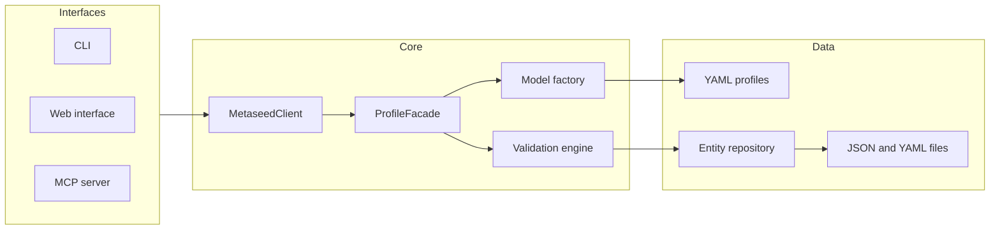

# Metaseed

[](https://github.com/sorenwacker/metaseed/actions/workflows/ci.yml)
[](https://codecov.io/gh/sorenwacker/metaseed)
[](https://pypi.org/project/metaseed/)
[](https://www.python.org/downloads/)
[](LICENSE)

Metaseed creates, edits, and validates scientific metadata against a standard, from a YAML specification of that standard.

[Documentation](https://sorenwacker.github.io/metaseed/) · [Introduction slides](https://sorenwacker.github.io/metaseed/slides/) · [Changelog](CHANGELOG.md)

## What it does

A metadata standard such as MIAPPE or ISA is written as a *profile*: a YAML file that names the entity types, their fields, the parent–child hierarchy, and the validation rules. From that file, Metaseed:

- Generates Pydantic models for every entity type at runtime.
- Validates a dataset with composable rules: required fields, patterns, ranges, uniqueness, referential integrity, and conditions.
- Serializes datasets to JSON, YAML, and Excel, and back.
- Exports to the formats repositories take: ISA-Tab, ENA XML, PRIDE `submission.px` with SDRF, DCAT, and SEEK's ISA RDF.
- Pushes a dataset into a running FAIRDOM-SEEK instance, or to a shared [metaseed-hub](https://github.com/sorenwacker/metaseed-hub).

You work with it from a command line, a web interface, a Python API, or an MCP server for an AI agent. All four reach the same library functions, and a test fails when one of them falls behind the others.

## Install

Metaseed requires Python 3.11 or later.

```bash
uv tool install metaseed
```

To include an integration, name its extra. For example, `metaseed[seek,dcat]` adds the FAIRDOM-SEEK and DCAT adapters; `metaseed[hub]` adds the hub client. The **Plugins** page in the web interface lists which extras are installed.

For development:

```bash
git clone https://github.com/sorenwacker/metaseed.git
cd metaseed
make setup
```

## Profiles

The package ships these profiles. Counts refer to each profile's latest version.

| Profile | `--profile` | Versions | Entities | Fields | Domain |
|---------|-------------|----------|----------|--------|--------|
| MIAPPE | `miappe` | 1.1, 1.2 | 14 | 163 | Plant phenotyping |
| MIAPPE-HTP | `miappe-htp` | 1.0 | 28 | 137 | High-throughput plant phenotyping |
| ISA | `isa` | 1.0 | 22 | 139 | Life science investigations |
| Darwin Core | `darwin-core` | 1.0 | 10 | 189 | Biodiversity |
| DiSSCo | `dissco` | 0.4 | 16 | 261 | Digital specimens |
| ENA | `ena` | 1.0 | 11 | 109 | Nucleotide archive submissions |
| MetaboLights | `metabolights` | 1.0 | 13 | 71 | Metabolomics |
| PRIDE | `pride` | 1.0, 2.0 | 9 | 61 | Proteomics |
| SEEK | `seek` | 1.0 | 24 | 229 | The FAIRDOM-SEEK data model |
| SEEK-ready template | `seek-ready-template` | 1.0, 2.0, 3.0 | 6 | 33 | Minimal ISA shape for a SEEK upload |

Profiles you write yourself go under `~/.local/share/metaseed/specs/`. The web interface's spec builder and the `metaseed spec` commands author them; the explorer compares them; `metaseed merge` combines them.

## Integrations

An adapter is a route in or out of a dataset. A profile is a standard; an adapter is a service or file format. Each adapter is a pip extra of the same name.

| Adapter | Direction | What it does |
|---------|-----------|--------------|
| FAIRDOM-SEEK | push, export | Creates Sample Types and Extended Metadata on a SEEK instance and pushes a dataset as ISA content; exports SEEK-importable ISA RDF ([guide](docs/guides/seek-export.md)) |
| Metaseed Hub | push, pull | Pushes datasets and profiles to a metaseed-hub and pulls them back, never overwriting without being asked ([guide](docs/guides/hub-sync.md)) |
| DCAT | export | Exports a dataset's catalogue record as DCAT, in JSON-LD and Turtle |
| ENA | import, export | Imports the metadata of a European Nucleotide Archive accession; exports ENA XML |
| PRIDE | import, export | Imports a PRIDE Archive project; exports `submission.px` and SDRF |
| MetaboLights | import | Imports a MetaboLights study document |
| BrAPI | import | Imports a BrAPI v2 server's studies into the MIAPPE profile |

## Use it

### Command line

The CLI is grouped by what you act on. Every group prints its own help, for example `metaseed dataset --help`.

```bash
metaseed profiles                                  # the profiles and their versions
metaseed profile schema --profile miappe -v 1.2    # entity types and fields
metaseed dataset create test-drought --profile miappe -v 1.2
metaseed entity create test-drought Investigation --set unique_id=INV001 --set title="Drought trial"
metaseed dataset validate test-drought
metaseed dataset export test-drought --format dcat -o out/
metaseed ui                                        # the web interface
metaseed mcp --transport stdio                     # the MCP server, for Claude Desktop
```

Output is JSON, so a script reads what a person reads. The [CLI reference](docs/api/cli.md) lists every command; [Capability parity](docs/specification/capability-parity.md) records which command, MCP tool, and web route serve each capability.

### Python

```python
from metaseed import MetaseedClient

client = MetaseedClient("miappe", "1.2")

investigation = client.create_entity(
    "Investigation",
    {"unique_id": "INV001", "title": "Drought tolerance trial"},
)
client.create_entity(
    "Study",
    {"unique_id": "STU001", "title": "Field trial 2024", "start_date": "2024-03-01"},
    parent_id=investigation.id,
)

result = client.validate()
print(result.valid, [issue.message for issue in result.issues])
```

The [Python API reference](docs/api/client.md) covers the client; the [public API contract](docs/specification/api-contract.md) lists what is stable.

### Web interface

`metaseed ui` serves the datasets overview, entity forms and tables, validation, the graph view, the profile explorer, the spec builder, and the Plugins page for the adapters.

### MCP server

`metaseed mcp` exposes the same capabilities as tools for an AI agent: profile discovery, dataset and entity editing, extraction from source files, validation, ontology lookup, and specification authoring. See the [MCP setup guide](docs/guides/mcp-setup.md).

## Validation

Rules are part of the profile, in YAML:

```yaml
validation_rules:
  - name: study_unique_within_investigation
    type: uniqueness
    applies_to: [Study]
    field: unique_id
    unique_within: parent

  - name: observation_unit_names_a_study
    type: referential_integrity
    applies_to: [ObservationUnit]
    field: study_id
    reference: Study.unique_id
```

Rule types cover required fields, patterns, numeric and date ranges, coordinate pairs, uniqueness within a parent or globally, referential integrity, and conditions.

## Architecture



The [architecture overview](docs/architecture/overview.md) describes each layer.

## Development

```bash
make setup    # dependencies and pre-commit hooks
make dev      # the web interface with reload
make test     # the test suite
make lint     # ruff and mypy
make docs     # the documentation site with reload
```

The project follows document-driven and test-driven development: a change starts in `docs/`, gets a test, then an implementation. Rules are enforced by tests rather than by review; the [contributing guide](docs/development/contributing.md) lists them.

## Data sources and attribution

Ontology lookup and validation use the [EMBL-EBI Ontology Lookup Service (OLS4)](https://www.ebi.ac.uk/ols4/). Term data comes from the public OLS4 API and stays the property of the source ontologies; use of OLS is subject to the [EMBL-EBI terms of use](https://www.ebi.ac.uk/about/terms-of-use/). Metaseed caches results, limits its request rate, and identifies itself with a descriptive `User-Agent`. For bulk term resolution, download the source ontologies or run a local OLS instance instead of using the public API.

## License

[MIT](LICENSE)
