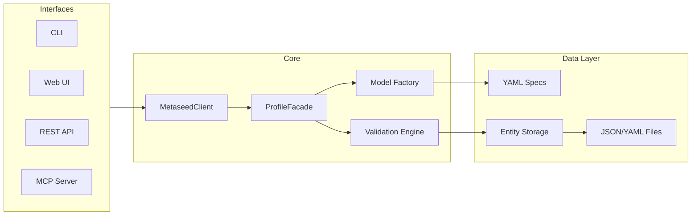

# Metaseed

[](https://github.com/sorenwacker/metaseed/actions/workflows/ci.yml)
[](https://codecov.io/gh/sorenwacker/metaseed)

Schema-driven metadata management from YAML specifications.

[Documentation](https://sorenwacker.github.io/metaseed/) | [Introduction Slides](https://sorenwacker.github.io/metaseed/slides/)

## What is Metaseed?

A **schema-driven metadata management system** that:

- Defines entity schemas in human-readable YAML
- Generates Pydantic models dynamically at runtime
- Validates with composable rules
- Supports multiple metadata standards (MIAPPE, ISA, Darwin Core, ...)
- Exports a dataset as a DCAT catalog card (JSON-LD / Turtle) for data portals and FAIR assessment

```
YAML specs → Pydantic models → Validation → Serialization
```

## Installation

Requires Python 3.11+

```bash
# Install from GitHub
uv tool install git+https://github.com/sorenwacker/metaseed.git

# Or for development
git clone https://github.com/sorenwacker/metaseed.git
cd metaseed
uv sync --extra dev
```

## Supported Profiles

| Profile | Version | Entities | Fields | Domain |
|---------|---------|----------|--------|--------|
| MIAPPE | 1.2 | 14 | 163 | Plant phenotyping |
| ISA | 1.0 | 22 | 139 | Life science |
| Darwin Core | 1.0 | 10 | 189 | Biodiversity |
| DiSSCo | 0.4 | 16 | 261 | Digital specimens |
| ENA | 1.0 | 11 | 109 | Nucleotide archive |
| JERM | 1.0 | 24 | 229 | Systems biology |

User-defined profiles supported in `~/.local/share/metaseed/specs/`

## Modi Operandi

Metaseed operates in **four modes**:

| Mode | Interface | Use Case |
|------|-----------|----------|
| CLI | `metaseed` | Script automation |
| Web UI | Browser | Visual editing |
| REST API | HTTP | System integration |
| Python API | Library | Programmatic access |
| MCP Server | AI | Claude integration |

### CLI Mode

```bash
# List entities in a profile
metaseed entities miappe 1.2

# Generate entity template
metaseed template miappe 1.2 Investigation

# Validate a dataset
metaseed validate dataset.yaml --profile miappe --version 1.2

# Start web UI
metaseed ui

# Start MCP server (for Claude Desktop)
metaseed mcp --transport stdio
```

### Python API

```python
from metaseed import MetaseedClient

client = MetaseedClient("miappe", "1.2")

# Create root entity
inv = client.create_entity("Investigation", {
    "unique_id": "INV001",
    "title": "Drought Tolerance Study",
    "description": "Multi-year field trial..."
})

# Create child with parent linkage
study = client.create_entity("Study", {
    "unique_id": "STU001",
    "title": "Field Trial 2024",
    "start_date": "2024-03-01"
}, parent_id=inv.id)

# Validate entire dataset
result = client.validate()
print(f"Valid: {result.is_valid}, Errors: {len(result.errors)}")
```

## Architecture



## Validation

Composable validation rules defined in YAML:

- Required field checking
- Pattern matching (regex)
- Range validation (min/max)
- Date range validation
- Coordinate pair validation
- Uniqueness constraints (within parent or global)
- Referential integrity (foreign keys)
- Conditional rules

```yaml
validation:
  - type: uniqueness
    entity: Study
    field: unique_id
    scope: parent

  - type: referential_integrity
    entity: ObservationUnit
    field: study_id
    references:
      entity: Study
      field: unique_id
```

## MCP Integration

Model Context Protocol enables AI-assisted metadata extraction with Claude.

**Tool categories:**
- Profile Discovery — `list_profiles`, `get_profile_schema`
- File Extraction — `parse_source_file`, `extract_entities`
- Entity CRUD — `create_entity`, `update_entity`, `delete_entity`
- Validation — `validate_entity`, `validate_dataset`
- Ontology — `search_ontology`, `suggest_ontology_term`

## Technology Stack

| Layer | Technologies |
|-------|-------------|
| Core | Python 3.11+, Pydantic 2.0+ |
| Interfaces | FastAPI, Typer, HTMX, Jinja2 |
| Data | PyYAML, openpyxl |
| Agent | mcp, FastMCP |
| Dev | uv, pytest, ruff, pre-commit |

## Development

```bash
make setup    # Install dependencies + pre-commit hooks
make dev      # Start development server
make test     # Run tests
make lint     # Run linter
make docs     # Serve documentation locally
```

## Data sources and attribution

Ontology term lookup and validation use the [EMBL-EBI Ontology Lookup Service
(OLS4)](https://www.ebi.ac.uk/ols4/). Term data is retrieved from the public OLS4
API and remains the property of the respective source ontologies. Use of OLS is
subject to the [EMBL-EBI Terms of Use](https://www.ebi.ac.uk/about/terms-of-use/).

Metaseed is a considerate API client: it caches results, rate-limits requests, and
identifies itself with a descriptive `User-Agent`. For bulk or high-volume term
resolution, prefer downloading the source ontologies or running a local OLS
instance rather than the public API.

## License

MIT
