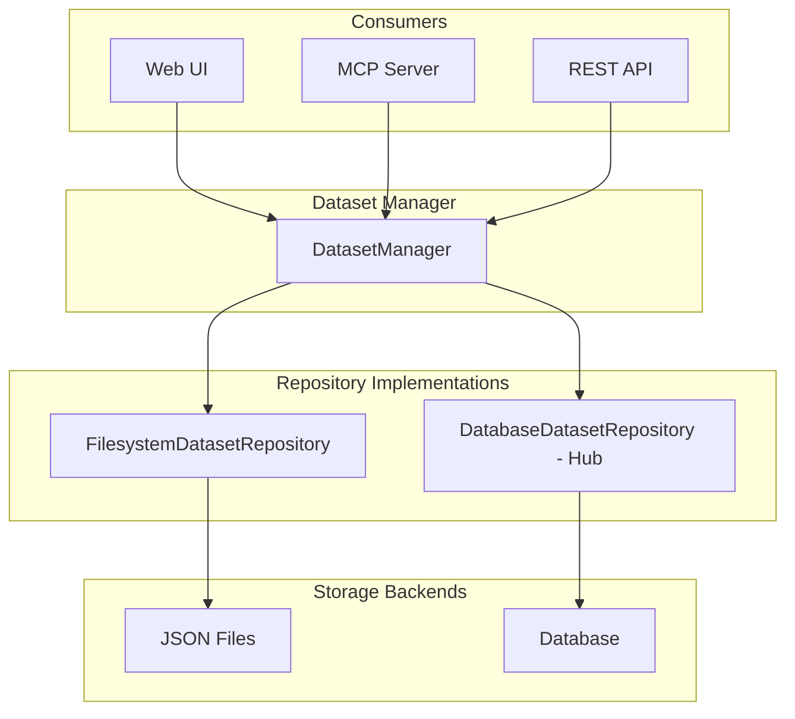

# Dataset Repository Architecture

The dataset repository provides a unified API for dataset storage operations, enabling metaseed-hub and other integrations to swap in custom storage backends (e.g., database) while the standalone metaseed uses filesystem storage.

## Overview



## Components

| Component | Location | Responsibility |
|-----------|----------|----------------|
| **DatasetRepository** | `metaseed.repositories.dataset_repository` | Abstract interface for dataset storage |
| **DatasetInfo** | `metaseed.repositories.dataset_repository` | Summary info for listing |
| **DatasetData** | `metaseed.repositories.dataset_repository` | Full dataset contents |
| **FilesystemDatasetRepository** | `metaseed.repositories.filesystem_dataset` | JSON file-based storage |
| **DatasetManager** | `metaseed.ui.dataset_manager` | Business logic + state integration |

## DatasetRepository Interface

The `DatasetRepository` ABC defines the contract for dataset persistence:

```python
from metaseed.repositories import DatasetRepository, DatasetInfo, DatasetData

class DatasetRepository(ABC):
    def list(self) -> list[DatasetInfo]: ...
    def save(self, name: str, data: DatasetData) -> DatasetInfo: ...
    def load(self, name: str) -> DatasetData: ...
    def delete(self, name: str) -> bool: ...
    def exists(self, name: str) -> bool: ...

    @staticmethod
    def validate_name(name: str) -> str | None: ...
```

## Data Classes

### DatasetInfo

Summary information for listing datasets:

```python
@dataclass
class DatasetInfo:
    name: str           # Dataset identifier
    profile: str        # Profile name (e.g., "miappe")
    version: str        # Profile version (e.g., "1.2")
    entity_count: int   # Number of entities
    modified: str       # ISO timestamp
```

### DatasetData

Full dataset contents for save/load:

```python
@dataclass
class DatasetData:
    name: str
    profile: str
    version: str
    entities: list[dict]  # Serialized entity data
    modified: str
```

## Usage Patterns

### Standalone Metaseed (Default)

Uses filesystem storage automatically:

```python
from metaseed.ui.dataset_manager import get_manager
from metaseed.ui.state import AppState

state = AppState(profile="miappe")
manager = get_manager(state)

# List datasets
datasets = manager.list_datasets()

# Save current state
info = manager.save_dataset("my-experiment")

# Load dataset
info = manager.load_dataset("my-experiment")

# Delete dataset
manager.delete_dataset("old-experiment")
```

### metaseed-hub Integration

Swap in a database backend at app startup:

```python
from metaseed.repositories import DatasetRepository, DatasetInfo, DatasetData
from metaseed.ui.dataset_manager import set_repository

class DatabaseDatasetRepository(DatasetRepository):
    """Database-backed dataset storage for metaseed-hub."""

    def __init__(self, db_session):
        self._db = db_session

    def list(self) -> list[DatasetInfo]:
        return [
            DatasetInfo(
                name=row.name,
                profile=row.profile,
                version=row.version,
                entity_count=row.entity_count,
                modified=row.modified.isoformat(),
            )
            for row in self._db.query(Dataset).all()
        ]

    def save(self, name: str, data: DatasetData) -> DatasetInfo:
        error = self.validate_name(name)
        if error:
            raise ValueError(error)

        dataset = self._db.query(Dataset).filter_by(name=name).first()
        if dataset:
            dataset.profile = data.profile
            dataset.version = data.version
            dataset.entities = data.entities
            dataset.modified = datetime.now()
        else:
            dataset = Dataset(
                name=name,
                profile=data.profile,
                version=data.version,
                entities=data.entities,
            )
            self._db.add(dataset)

        self._db.commit()
        return DatasetInfo(...)

    def load(self, name: str) -> DatasetData:
        dataset = self._db.query(Dataset).filter_by(name=name).first()
        if not dataset:
            raise FileNotFoundError(f"Dataset not found: {name}")
        return DatasetData(
            name=dataset.name,
            profile=dataset.profile,
            version=dataset.version,
            entities=dataset.entities,
            modified=dataset.modified.isoformat(),
        )

    def delete(self, name: str) -> bool:
        dataset = self._db.query(Dataset).filter_by(name=name).first()
        if dataset:
            self._db.delete(dataset)
            self._db.commit()
            return True
        return False

    def exists(self, name: str) -> bool:
        return self._db.query(Dataset).filter_by(name=name).count() > 0


# In metaseed-hub app startup:
def create_app(db_session):
    # Configure custom repository BEFORE any dataset operations
    set_repository(DatabaseDatasetRepository(db_session))

    # Now all dataset operations use the database
    from metaseed.ui.app import create_app as create_metaseed_app
    return create_metaseed_app()
```

### Direct Repository Access

For scripts or external tools:

```python
from metaseed.repositories import FilesystemDatasetRepository, DatasetData

# Custom storage location
repo = FilesystemDatasetRepository(Path("/data/metaseed/datasets"))

# List available datasets
for info in repo.list():
    print(f"{info.name}: {info.profile}/{info.version} ({info.entity_count} entities)")

# Load and inspect
data = repo.load("experiment-2024")
for entity in data.entities:
    print(f"  {entity['_type']}: {entity.get('title', entity.get('unique_id'))}")
```

## Module-Level Functions

For dependency injection configuration:

```python
from metaseed.ui.dataset_manager import (
    set_repository,   # Configure custom repository
    get_repository,   # Get current repository
    get_manager,      # Get DatasetManager instance
    reset_manager,    # Clear cached manager (for testing)
)
```

## Backward Compatibility

The `metaseed.ui.datasets` module provides backward-compatible functions:

```python
from metaseed.ui.datasets import (
    list_datasets,           # Returns list[dict]
    save_dataset,            # state, name -> dict
    load_dataset,            # state, name -> dict
    delete_dataset,          # name -> bool
    get_current_dataset_name,
    set_current_dataset_name,
    auto_save,
)
```

These delegate to DatasetManager internally.

## File Format

FilesystemDatasetRepository stores datasets as JSON:

```json
{
  "name": "my-experiment",
  "profile": "miappe",
  "version": "1.2",
  "modified": "2024-01-15T10:30:00",
  "entities": [
    {
      "_type": "Investigation",
      "_parent_unique_id": null,
      "unique_id": "INV-001",
      "title": "My Investigation"
    },
    {
      "_type": "Study",
      "_parent_unique_id": "INV-001",
      "unique_id": "STU-001",
      "title": "Study One",
      "investigation_id": "INV-001"
    }
  ]
}
```

## Design Principles

1. **Dependency Injection**: Repository set at startup, consumed via DatasetManager
2. **Interface Segregation**: Focused DatasetRepository interface
3. **Single Responsibility**: Manager handles state integration, repository handles storage
4. **Open/Closed**: New backends (database, S3, etc.) without modifying existing code
5. **Backward Compatibility**: Module functions preserve existing API
