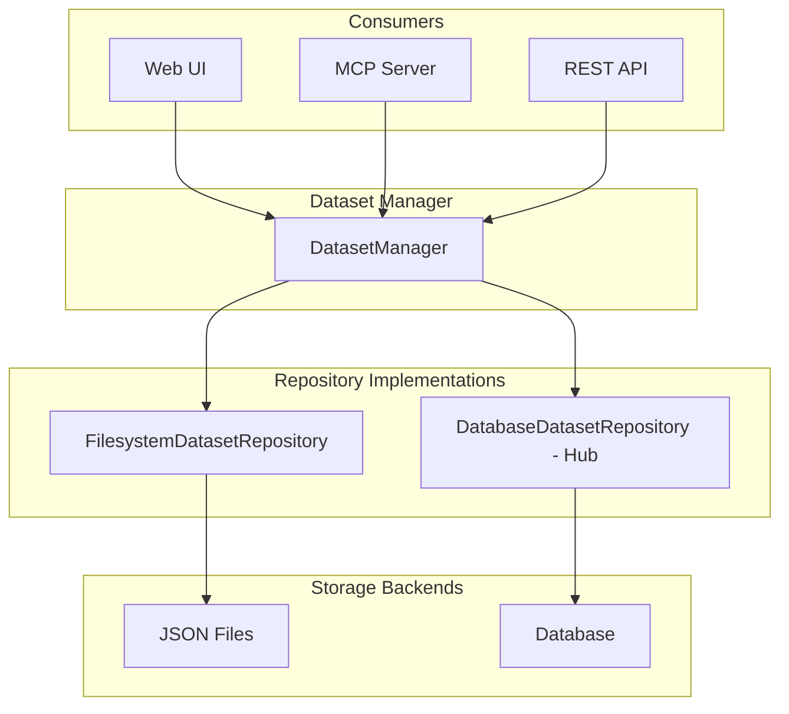

# Dataset Repository Architecture

The dataset repository provides a unified API for dataset storage operations, enabling metaseed-hub and other integrations to swap in custom storage backends (e.g., database) while the standalone metaseed uses filesystem storage.

## Overview



## Components

| Component | Location | Responsibility |
|-----------|----------|----------------|
| **DatasetRepository** | `metaseed.repositories.dataset_repository` | Abstract storage interface |
| **DatasetInfo** | `metaseed.repositories.dataset_repository` | Summary info for listing |
| **DatasetData** | `metaseed.repositories.dataset_repository` | Full dataset contents |
| **FilesystemDatasetRepository** | `metaseed.repositories.filesystem_dataset` | JSON file-based storage |
| **DatasetManager** | `metaseed.ui.dataset_manager` | Business logic + state integration |
| **DatasetManagerFactory** | `metaseed.ui.dataset_manager` | Creates managers bound to an `AppState` |

## DatasetRepository Interface

The repository interface defines the storage contract. Backends (filesystem,
database, object store) implement it and are injected via `DatasetManagerFactory`.

```python
from metaseed.repositories import DatasetRepository, DatasetInfo, DatasetData

class DatasetRepository(ABC):
    def list(self) -> list[DatasetInfo]: ...
    def save(self, name: str, data: DatasetData) -> DatasetInfo: ...
    def load(self, name: str) -> DatasetData: ...
    def delete(self, name: str) -> bool: ...
    def exists(self, name: str) -> bool: ...

    @staticmethod
    def validate_name(name: str) -> str | None: ...
```

## Data Classes

### DatasetInfo

Summary information for listing datasets:

```python
@dataclass
class DatasetInfo:
    name: str           # Dataset identifier
    profile: str        # Profile name (e.g., "miappe")
    version: str        # Profile version (e.g., "1.2")
    entity_count: int   # Number of entities
    modified: str       # ISO timestamp
```

### DatasetData

Full dataset contents for save/load:

```python
@dataclass
class DatasetData:
    name: str
    profile: str
    version: str
    entities: list[dict]  # Serialized entity data
    modified: str
```

## Usage Patterns

### Standalone Metaseed (Default)

Uses filesystem storage automatically. A `DatasetManagerFactory` creates a
manager bound to an `AppState` (the default factory uses
`FilesystemDatasetRepository`):

```python
from metaseed.ui.dataset_manager import DatasetManagerFactory
from metaseed.ui.state import AppState

state = AppState(profile="miappe")
manager = DatasetManagerFactory().get_manager(state)

# List datasets
datasets = manager.list_datasets()

# Save current state
info = manager.save_dataset("my-experiment")

# Load dataset
info = manager.load_dataset("my-experiment")

# Delete dataset
manager.delete_dataset("old-experiment")
```

Inside a request handler, use `resolve_dataset_manager(app, state)` instead of
constructing a factory directly; it reuses the MCP-session factory when one is
attached to the app so UI and MCP operations share a repository:

```python
from metaseed.ui.dataset_manager import resolve_dataset_manager

manager = resolve_dataset_manager(app, state)
info = manager.save_dataset("my-experiment")
```

### metaseed-hub Integration (Custom Backend)

metaseed-hub swaps in a custom `DatasetRepository` by constructing a
`DatasetManagerFactory` with it. The factory then hands out managers backed by
that repository instead of the default filesystem store:

```python
from metaseed.repositories import DatasetRepository, DatasetInfo, DatasetData
from metaseed.ui.dataset_manager import DatasetManagerFactory


class DatabaseDatasetRepository(DatasetRepository):
    """Database-backed dataset storage for metaseed-hub."""

    def __init__(self, session):
        self._session = session

    def list(self) -> list[DatasetInfo]:
        ...

    def save(self, name: str, data: DatasetData) -> DatasetInfo:
        error = self.validate_name(name)
        if error:
            raise ValueError(error)
        ...

    def load(self, name: str) -> DatasetData:
        ...

    def delete(self, name: str) -> bool:
        ...

    def exists(self, name: str) -> bool:
        ...


# Build a factory bound to the custom repository, then create managers from it.
factory = DatasetManagerFactory(sync_repo=DatabaseDatasetRepository(session))
manager = factory.get_manager(state)
```

The factory is attached to the app (via the MCP context) so that
`resolve_dataset_manager(app, state)` returns managers using this backend for
every request in the session.

### Direct Repository Access

For scripts or external tools:

```python
from metaseed.repositories import FilesystemDatasetRepository, DatasetData

# Custom storage location
repo = FilesystemDatasetRepository(Path("/data/metaseed/datasets"))

# List available datasets
for info in repo.list():
    print(f"{info.name}: {info.profile}/{info.version} ({info.entity_count} entities)")

# Load and inspect
data = repo.load("experiment-2024")
for entity in data.entities:
    print(f"  {entity['_type']}: {entity.get('title', entity.get('unique_id'))}")
```

## Dependency Injection API

Managers are created through `DatasetManagerFactory` and resolved per request
with `resolve_dataset_manager`:

```python
from metaseed.ui.dataset_manager import (
    DatasetManager,          # Business logic + state integration
    DatasetManagerFactory,   # Creates managers bound to an AppState
    resolve_dataset_manager, # Resolves the manager for a request
)
```

| Symbol | Purpose |
|--------|---------|
| `DatasetManagerFactory(sync_repo=...)` | Holds the repository; `get_manager(state)` returns a manager for that state |
| `DatasetManagerFactory.get_manager(state)` | Get or create the `DatasetManager` bound to `state` |
| `resolve_dataset_manager(app, state)` | Prefer the MCP-session factory attached to `app`, else a default factory |

The factory caches managers per `AppState` using a `WeakValueDictionary`, so
managers are garbage-collected when their state is released.

## Backward Compatibility

The `metaseed.ui.datasets` module provides backward-compatible functions:

```python
from metaseed.ui.datasets import (
    list_datasets,           # Returns list[dict]
    save_dataset,            # state, name -> dict
    load_dataset,            # state, name -> dict
    delete_dataset,          # name -> bool
    get_current_dataset_name,
    set_current_dataset_name,
    auto_save,
)
```

These delegate to DatasetManager internally.

## File Format

FilesystemDatasetRepository stores datasets as JSON:

```json
{
  "name": "my-experiment",
  "profile": "miappe",
  "version": "1.2",
  "modified": "2024-01-15T10:30:00",
  "entities": [
    {
      "_type": "Investigation",
      "_parent_unique_id": null,
      "unique_id": "INV-001",
      "title": "My Investigation"
    },
    {
      "_type": "Study",
      "_parent_unique_id": "INV-001",
      "unique_id": "STU-001",
      "title": "Study One",
      "investigation_id": "INV-001"
    }
  ]
}
```

## Design Principles

The dataset repository follows the same repository-layer principles documented
for the [entity repository](entity-repository.md#design-principles): dependency
injection, interface segregation, single responsibility, and open/closed. In
addition, the `metaseed.ui.datasets` module preserves a backward-compatible
function API that delegates to `DatasetManager` internally.
