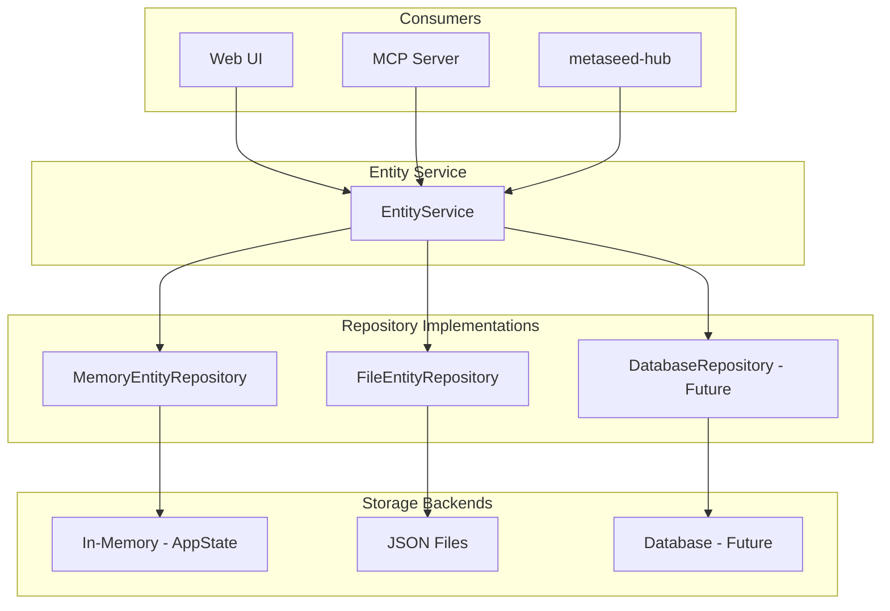

# Entity Repository Architecture

The entity repository provides a unified API for entity CRUD operations, enabling consistent data access across UI, MCP, and external integrations.

## Overview



## Components

| Component | Location | Responsibility |
|-----------|----------|----------------|
| **EntityRepository** | `metaseed.repositories.base` | Abstract interface for entity storage |
| **EntityData** | `metaseed.repositories.base` | Transfer object with hierarchy info |
| **FileEntityRepository** | `metaseed.repositories.file` | JSON file-based persistence |
| **MemoryEntityRepository** | `metaseed.repositories.memory` | Wraps in-memory AppState as a repository |
| **EntityService** | `metaseed.ui.services.entities` | Business logic layer |

## EntityRepository Interface

The `EntityRepository` ABC defines the contract for entity persistence:

```python
from metaseed.repositories import EntityRepository, EntityData

class EntityRepository(ABC):
    def list_entities(self, entity_type: str | None = None) -> list[EntityData]: ...
    def get_entity(self, entity_id: str) -> EntityData | None: ...
    def create_entity(self, entity_type: str, data: dict, parent_id: str | None = None) -> EntityData: ...
    def update_entity(self, entity_id: str, data: dict) -> EntityData: ...
    def delete_entity(self, entity_id: str) -> bool: ...
    def get_tree(self) -> list[EntityData]: ...
    def get_profile(self) -> str: ...
    def get_version(self) -> str | None: ...
    def set_profile(self, profile: str, version: str | None = None) -> None: ...
```

## EntityData

The `EntityData` dataclass is the transfer object between repository and consumers:

```python
@dataclass
class EntityData:
    id: str
    entity_type: str
    label: str
    data: dict[str, Any]
    parent_id: str | None = None
    children: list[EntityData] = field(default_factory=list)
```

## Usage Patterns

### UI with AppState

The UI uses `MemoryEntityRepository` to wrap the in-memory `AppState`:

```python
from metaseed.ui.state import AppState
from metaseed.repositories import MemoryEntityRepository
from metaseed.ui.services.entities import EntityService

state = AppState(profile="miappe")
repo = MemoryEntityRepository(state)
service = EntityService(repo)

# Create entity
result = service.create_entity("Investigation", {"title": "My Study"})
```

### MCP with File Repository

The MCP server can use `FileEntityRepository` for file-based state sharing:

```python
from metaseed.repositories import FileEntityRepository
from metaseed.ui.services.entities import EntityService

repo = FileEntityRepository.from_dataset_name("my-dataset")
service = EntityService(repo)

# Both MCP and UI can read/write to the same file
entity = service.get_entity("abc123")
```

### External Integration

For metaseed-hub or other integrations:

```python
from metaseed.repositories import FileEntityRepository

# Point to shared dataset location
repo = FileEntityRepository(
    dataset_path=Path("/shared/data/project.json"),
    profile="miappe",
    version="1.2",
)

# Direct repository access
entities = repo.list_entities("Investigation")
tree = repo.get_tree()
```

## File Format

`FileEntityRepository` uses JSON with hierarchy metadata:

```json
{
  "profile": "miappe",
  "version": "1.2",
  "modified": "2024-01-15T10:30:00",
  "entities": [
    {
      "id": "abc123",
      "entity_type": "Investigation",
      "label": "My Investigation",
      "parent_id": null,
      "unique_id": "INV-001",
      "title": "My Investigation"
    },
    {
      "id": "def456",
      "entity_type": "Study",
      "label": "Study One",
      "parent_id": "abc123",
      "unique_id": "STU-001",
      "title": "Study One",
      "investigation_id": "INV-001"
    }
  ]
}
```

## Tree Hierarchy

Entities form a tree structure managed by `TreeNode` parent-child relationships:

```
Investigation (root)
├── Study (parent_id -> Investigation)
│   ├── ObservationUnit (parent_id -> Study)
│   └── BiologicalMaterial (parent_id -> Study)
└── Person (parent_id -> Investigation)
```

The hierarchy is separate from Pydantic model nested fields, which contain string references to related entities.

## State Synchronization

For multi-process scenarios (UI + MCP):

1. Both processes use `FileEntityRepository` pointing to the same dataset file
2. Call `repo.reload()` to sync with external changes
3. WebSocket notifications signal when changes occur

```python
# In MCP after making changes
repo._save()  # Write to file

# In UI to pick up changes
repo.reload()  # Read from file
```

## Service Operations

All entity operations are methods on `EntityService`; there are no module-level
functions. Construct a service with a repository and call its methods:

```python
from metaseed.ui.state import AppState
from metaseed.repositories import MemoryEntityRepository
from metaseed.ui.services.entities import EntityService

service = EntityService(MemoryEntityRepository(AppState(profile="miappe")))

result = service.create_entity("Investigation", {"title": "Test"})
entities = service.list_entities()          # all entities, grouped by type
tree = service.get_tree()                   # nested tree structure
service.update_entity(result["id"], {"title": "Renamed"})
service.delete_entity(result["id"])
```

## Design Principles

The repository layer, shared by both the entity and dataset repositories,
follows these principles:

1. **Dependency Injection**: Repository passed to the service/manager, not global state
2. **Interface Segregation**: Small, focused repository interfaces
3. **Single Responsibility**: Service handles business logic, repository handles persistence
4. **Open/Closed**: New backends added without modifying existing code
