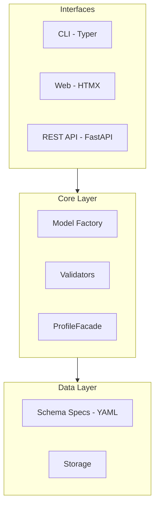

# Architecture Overview

Metaseed follows a schema-driven architecture where YAML specifications define the metadata structure, and Pydantic models are generated dynamically at runtime.

## System Components

## Component Responsibilities

### Schema Specs

YAML files defining MIAPPE metadata fields, types, cardinality, and ontology references. These serve as the single source of truth for validation rules.

### Model Factory

Generates Pydantic models from schema specifications at runtime. This approach allows:

- Version-specific model generation (MIAPPE 1.1, 1.2)
- Runtime validation without code duplication
- Easy schema updates without code changes

### Validators

Business logic for validating metadata beyond type checking:

- Cross-field validation
- Ontology term validation
- Referential integrity checks

### Storage

Persistence layer abstraction supporting multiple backends:

- File-based storage (JSON, YAML)
- Database backends (future)

### ProfileFacade

A fluent API layer providing intuitive access to entity helpers:

- **Entity Discovery**: `facade.entities` lists available entity types
- **Entity Helpers**: `facade.Investigation` provides field info and creation
- **Profile Support**: Separate facades for MIAPPE and ISA profiles via `miappe()` and `isa()` functions

### Interfaces

- **CLI**: Command-line interface for batch operations and scripting
- **Web UI**: HTMX-based visual editor with dynamic forms
- **REST API**: HTTP endpoints for integration with other systems

## Design Principles

1. **Schema-first**: All metadata structure defined in YAML specs
2. **Ontology-backed**: References to established ontologies (PPEO, ISA, PROV-O)
3. **Validation-focused**: Multiple validation layers ensure data quality
4. **Interface-agnostic**: Core logic separated from interface implementations
