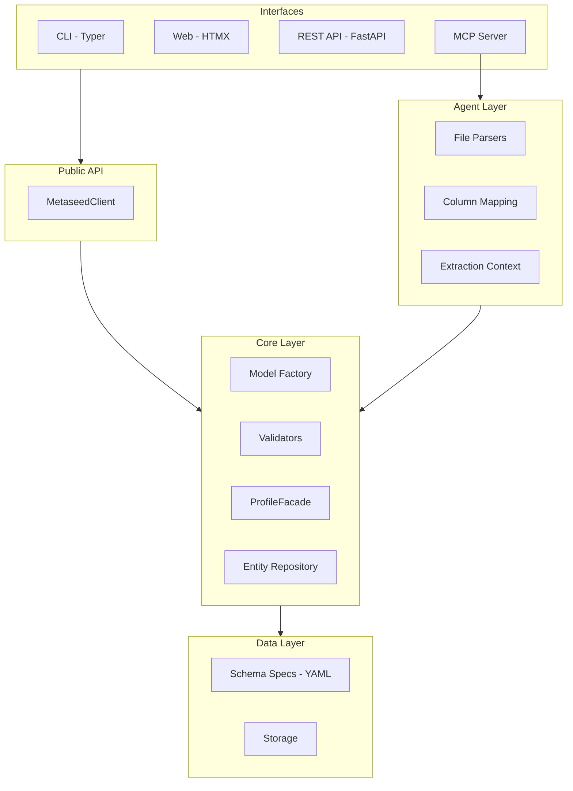

# Architecture Overview

Schema-driven architecture where YAML specs define metadata structure, and Pydantic models are generated at runtime.


```mermaid
graph TB
    subgraph Interfaces
        CLI[CLI - Typer]
        Web[Web - HTMX]
        API[REST API - FastAPI]
        MCP[MCP Server]
    end

    subgraph PublicAPI["Public API"]
        Client[MetaseedClient]
    end

    subgraph Core["Core Layer"]
        Factory[Model Factory]
        Validators
        Facade[ProfileFacade]
        Repos[Entity Repository]
    end

    subgraph Data["Data Layer"]
        Specs[Schema Specs - YAML]
        Storage
    end

    subgraph Agent["Agent Layer"]
        Parsers[File Parsers]
        Mapping[Column Mapping]
        Extract[Extraction Context]
    end

    Interfaces --> PublicAPI
    PublicAPI --> Core
    Core --> Data
    MCP --> Agent
    Agent --> Core
```

## Components

| Component | Responsibility |
|-----------|----------------|
| **[MetaseedClient](../api/client.md)** | Clean public API for programmatic access |
| **Schema Specs** | YAML files defining fields, types, and ontology references |
| **Model Factory** | Generates Pydantic models from specs at runtime |
| **Validators** | Cross-field validation, ontology checks, referential integrity |
| **ProfileFacade** | Fluent API for entity discovery and creation (internal) |
| **[Entity Repository](entity-repository.md)** | Unified API for entity CRUD with pluggable backends |
| **[Metadata Agent](metadata-agent.md)** | AI-assisted metadata extraction via MCP |
| **CLI** | Command-line interface (Typer) |
| **Web UI** | Visual editor (HTMX) |
| **REST API** | HTTP endpoints (FastAPI) |

## Design Principles

1. **Schema-first**: Metadata structure defined in YAML specs
2. **Ontology-backed**: References to PPEO, ISA, PROV-O ontologies
3. **Validation-focused**: Multiple validation layers
4. **Interface-agnostic**: Core logic separated from interfaces
5. **Clean API boundary**: Public API decoupled from internal implementation

## Dependency Direction

Dependencies point one way: the interfaces (CLI, web UI, REST API, MCP server) depend on the core, and the core never imports an interface. In particular no package outside `metaseed.ui` imports `metaseed.ui`, so a consumer can import the tools without loading FastAPI. Two seams are exempt and named in [ADR 004](decisions/004-core-does-not-import-the-web-app.md), which also documents the gate (`tests/test_modularity.py`) that fails the build on a new edge.

## Public API Design

The `MetaseedClient` class provides a clean public API boundary that:

- Wraps `ProfileFacade` to hide internal implementation details
- Returns immutable domain objects (`Entity`, `EntityNode`, `FieldInfo`) instead of internal types
- Uses a dedicated exception hierarchy (`MetaseedError` and subclasses)
- Supports both installed profiles and custom spec dictionaries

```python
from metaseed import MetaseedClient

client = MetaseedClient("miappe", "1.2")
inv = client.create_entity("Investigation", {"unique_id": "INV-001", "title": "My Study"})
result = client.validate()
```

For interactive use (Jupyter notebooks), the `ProfileFacade` convenience functions remain available:

```python
from metaseed import miappe
m = miappe()
m.Investigation.help()  # Tab completion and help
```

## Dependency Injection

The codebase uses dependency injection rather than module-level globals.

### MCPContext

`MCPContext` holds what an MCP tool needs: the session's state, a factory for
its entity service, and its dataset factory.

```python
from metaseed.agent.mcp.context import MCPContext

context = MCPContext(
    state=app_state,
    get_entity_service=lambda: EntityService(repo),
    dataset_factory=DatasetManagerFactory(),
)
```

**A tool never resolves its own context.** It is handed one per call, because
that is the only way two callers can share a process without sharing a session.
How it is handed one depends on how many callers there are:

- **One caller** — `metaseed mcp` and the web UI. `create_server()` with no
  argument serves a single process-wide session; `set_context` binds it. This
  is the intended use of the default, not a shortcut.
- **Several callers** — an HTTP host serving different people. It passes a
  resolver, called inside each tool body:

  ```python
  from metaseed.agent.mcp.caller import current_request
  from metaseed.agent.mcp.context import ContextUnavailableError

  def resolve() -> MCPContext:
      request = current_request()
      if request is None:
          raise ContextUnavailableError("no MCP request in scope")
      return context_for(authenticate(request))

  server = create_server(resolve_context=resolve)
  ```

  Note the missing fallback. A host that cannot identify its caller must fail,
  because the only thing left to fall back to is another caller's session.

The resolver is called *inside* the tool body deliberately: an MCP server
dispatches each handler from its own task group, so a context bound around the
HTTP request is not visible by the time the tool runs. `current_request()` reads
the SDK's own per-request channel, which is.

A gate (`tests/test_agent/test_mcp_tools_have_no_ambient_state.py`) fails the
build if a module under `agent/mcp/tools/` imports the server or picks its own
context — at any nesting depth, since the recurring mistake is an import inside
a function body that import-graph linters do not see.

| Field | Type | Description |
|-------|------|-------------|
| `state` | `AppState` | Shared application state |
| `get_entity_service` | `Callable` | Factory for EntityService instances |
| `dataset_factory` | `DatasetManagerFactory` | Manages dataset persistence |


The `cache_key` property enables consistent caching across components that operate on profile-version combinations.

## Entity Relationships

Entities are linked through **parent ID reference fields**. Each nested entity includes a reference to its parent, enabling:

- Round-trip Excel export/import
- Flat tabular representation
- Cross-entity validation

### MIAPPE Entity Hierarchy

```
Investigation
├── contacts → Person (investigation_id)
└── studies → Study (investigation_id)
    ├── persons → Person (study_id)
    ├── geographic_location → Location (study_id)
    ├── data_files → DataFile (study_id)
    ├── biological_materials → BiologicalMaterial (study_id)
    ├── observation_units → ObservationUnit (study_id)
    │   ├── samples → Sample (observation_unit_id)
    │   └── factor_values → FactorValue (observation_unit_id)
    ├── observed_variables → ObservedVariable (study_id)
    ├── factors → Factor (study_id)
    ├── events → Event (study_id)
    └── environments → Environment (study_id)
```

### Parent Reference Fields

| Entity | Parent Field | Parent Type |
|--------|--------------|-------------|
| Study | `investigation_id` | Investigation |
| Person | `investigation_id` or `study_id` | Investigation or Study |
| BiologicalMaterial | `study_id` | Study |
| ObservationUnit | `study_id` | Study |
| Sample | `observation_unit_id` | ObservationUnit |
| DataFile | `study_id` | Study |
| Factor | `study_id` | Study |
| FactorValue | `factor_id` | Factor |
| Event | `study_id` | Study |
| Environment | `study_id` | Study |
| Location | `study_id` | Study |

These references are required fields, ensuring every entity can be linked back to its parent for tabular export and validation.
