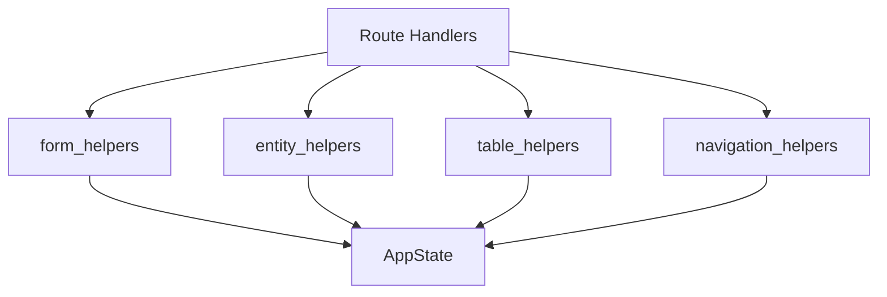

# UI Helper Modules

The UI layer is organized into focused helper modules that handle specific concerns. This separation improves testability and reduces coupling in the route handlers.



## form_helpers

Handles form rendering context and value collection.

### FormContext

Dataclass that encapsulates form rendering state, reducing parameter counts in template rendering.

```python
from metaseed.ui.form_helpers import FormContext

ctx = FormContext(
    entity_type="Study",
    helper=facade.Study,
    values={"title": "My Study"},
    node_id="abc123",  # None for create forms
)

# Access field categories
required = ctx.get_required_fields()
optional = ctx.get_optional_fields()
nested = ctx.get_nested_fields()
```

| Property | Description |
|----------|-------------|
| `is_edit` | True if editing existing entity |
| `description` | Entity description from spec |
| `ontology_term` | Ontology term from spec |

### Functions

| Function | Purpose |
|----------|---------|
| `collect_form_values(form_data, helper)` | Extract typed values from form submission |
| `filter_fields(fields, ...)` | Filter field list by required/nested criteria |
| `get_field_data(helper)` | Get field metadata for template rendering |
| `is_nested_field(field)` | Check if field dict represents nested entity |
| `format_validation_errors(e)` | Convert ValidationError to user-friendly messages |

## entity_helpers

Handles entity traversal and nested item extraction.

### Functions

| Function | Purpose |
|----------|---------|
| `to_dict(item)` | Convert Pydantic model or dict to plain dict |
| `walk_nested_entities(data, entity_type, facade)` | Recursively traverse nested entities, yielding (type, data) tuples |
| `extract_nested_items(instance, helper)` | Extract nested items from instance as dict mapping |
| `collect_entities_by_type(state, facade)` | Collect all entities (root and nested) organized by type |

### Example: Walking Nested Entities

```python
from metaseed.ui.entity_helpers import walk_nested_entities

investigation_data = {
    "unique_id": "INV-1",
    "studies": [
        {"unique_id": "STU-1", "observation_units": [...]}
    ]
}

for entity_type, data in walk_nested_entities(investigation_data, "Investigation", facade):
    print(f"{entity_type}: {data.get('unique_id')}")
# Output:
# Study: STU-1
# ObservationUnit: ...
```

## table_helpers

Handles inline table building for nested entity display.

### Functions

| Function | Purpose |
|----------|---------|
| `get_table_columns(facade, entity_type)` | Get column names for table (excludes nested fields) |
| `get_table_column_info(facade, entity_type)` | Get complete column metadata (types, constraints, required) |
| `build_inline_tables(state, facade, entity_type)` | Build table data for all nested fields of an entity |
| `get_items_store(state, parent_type, field_name)` | Get correct items store based on nested edit context |
| `format_table_rows(items)` | Format items list for table row rendering |

### Table Column Info

`get_table_column_info` returns a dictionary with:

| Key | Type | Description |
|-----|------|-------------|
| `columns` | `list[str]` | Column names to display |
| `column_types` | `dict[str, str]` | Field type per column |
| `column_constraints` | `dict[str, dict]` | Constraints per column |
| `required_columns` | `set[str]` | Required field names |
| `has_nested_children` | `bool` | Whether entity has nested children |

## navigation_helpers

Handles breadcrumb building and reference field resolution.

### Functions

| Function | Purpose |
|----------|---------|
| `build_breadcrumb(state)` | Build breadcrumb navigation from nested edit stack |
| `error_response(request, templates, message)` | Create error response with notification template |
| `get_reference_fields(profile, version, entity_type)` | Get all reference fields for an entity type |
| `get_parent_id_fields(reference_fields, parent_type)` | Get fields that reference the parent entity |
| `get_parent_identifier(state, parent_type, target_field)` | Get parent entity's identifier value |

### Reference Field Resolution

Reference fields link entities to their parents. The helper checks two sources:

1. Field definitions with `parent_ref` attribute (e.g., `parent_ref: Study.identifier`)
2. Validation rules with `reference` attribute (legacy)

```python
from metaseed.ui.navigation_helpers import get_reference_fields

refs = get_reference_fields("miappe", "1.2", "Sample")
# Returns:
# {
#     "observation_unit_id": {
#         "target_entity": "ObservationUnit",
#         "target_field": "unique_id"
#     }
# }
```

## Module Dependencies

```
form_helpers    (standalone)
entity_helpers  (standalone)
table_helpers   --> navigation_helpers (for reference fields)
navigation_helpers --> specs.loader
```

All modules depend on `AppState` for session state access.
