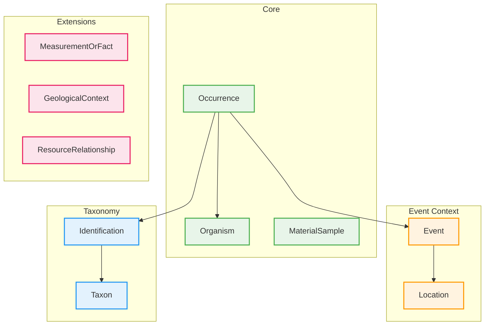
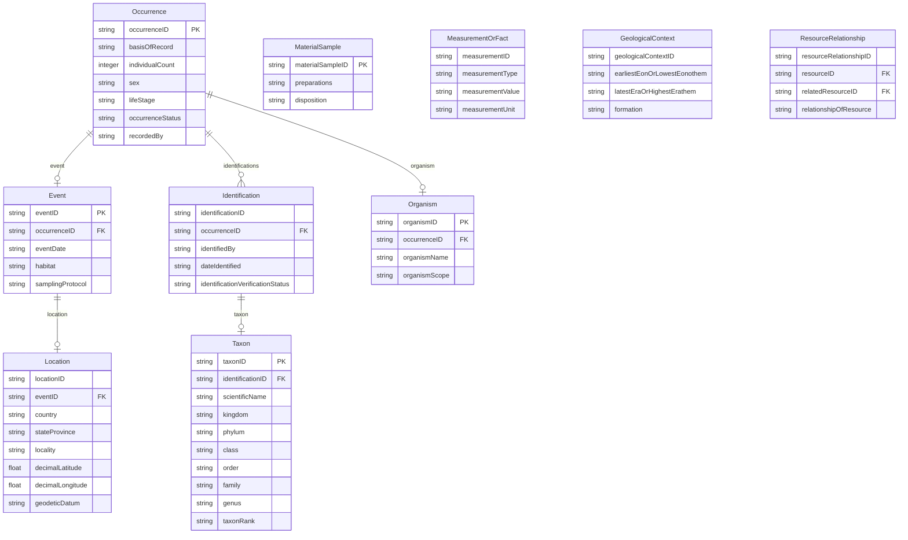

# Darwin Core v1.0

Darwin Core is a biodiversity data standard maintained by Biodiversity Information Standards (TDWG). It provides a standardized vocabulary for sharing information about biological occurrences, including species observations, specimen records, and sampling events.

Darwin Core centers on the **Occurrence** entity - evidence of an organism at a particular place and time. It supports both observational data (human or machine observations) and physical specimens (preserved, fossil, or living).

The standard is widely adopted by biodiversity data aggregators including GBIF (Global Biodiversity Information Facility), iDigBio, and VertNet.



## Entities

| Category | Entities |
|----------|----------|
| **Core** | Occurrence, Organism, MaterialSample |
| **Event Context** | Event, Location |
| **Taxonomy** | Identification, Taxon |
| **Extensions** | MeasurementOrFact, GeologicalContext, ResourceRelationship |

## Key Concepts

**Occurrence-centric**: Darwin Core is built around the Occurrence entity, which represents evidence of an organism at a specific location and time. Every record describes what was observed or collected, where, when, and by whom.

**Basis of Record**: Each occurrence has a basisOfRecord field that categorizes the type of evidence:

- `PreservedSpecimen` - Museum specimen
- `FossilSpecimen` - Paleontological specimen
- `LivingSpecimen` - Living collection specimen
- `HumanObservation` - Field observation by a person
- `MachineObservation` - Camera trap, acoustic sensor, etc.
- `MaterialSample` - DNA sample, tissue sample

**Taxonomic Identification**: Identifications link occurrences to taxa. Multiple identifications can exist for a single occurrence, representing different determinations over time. The Taxon entity holds the full taxonomic hierarchy from kingdom to subspecies.

**Location and Georeferencing**: The Location entity captures both named places (country, state, locality) and coordinates (decimal latitude/longitude). It supports uncertainty measures and different coordinate systems for georeferencing quality assessment.

## Validation Rules

The Darwin Core profile includes validation rules for:

- Coordinate ranges (latitude -90 to 90, longitude -180 to 180)
- Elevation and depth consistency (minimum cannot exceed maximum)
- Controlled vocabularies for basisOfRecord, occurrenceStatus, taxonRank
- Positive coordinate uncertainty values

### Cross-references

Seven fields declare what they point at, so a value naming nothing is reported rather than accepted as free text. They split by where the target lives:

| Field | Names | Resolves |
|---|---|---|
| `Event.occurrenceID`, `Identification.occurrenceID`, `Organism.occurrenceID` | `Occurrence.occurrenceID` | in this dataset |
| `Location.eventID` | `Event.eventID` | in this dataset |
| `Event.parentEventID` | `Event.eventID` | outside it |
| `Taxon.acceptedNameUsageID`, `Taxon.parentNameUsageID` | `Taxon.taxonID` | outside it |

The last three are `reference_scope: external` ([Entity References](../api/schema-specs.md#references-that-resolve-outside-the-dataset)). A taxon's accepted or parent name usage is normally an identifier in GBIF's backbone or Catalogue of Life, and a survey commonly cites the campaign it belonged to without shipping it. Declared as plain references they would report correct data as broken; left undeclared, as they were, they were checked by nothing at all. Scoped external, a value that *does* name a record in the dataset is still checked, and one that does not is reported as not checked.

## Use Cases

- **Biodiversity databases**: GBIF, iDigBio, VertNet, ALA
- **Natural history collections**: Digitization and sharing of museum specimens
- **Citizen science**: iNaturalist, eBird observation records
- **Ecological research**: Species distribution modeling, conservation assessments
- **Environmental monitoring**: Long-term population and community studies

## Entity-Relationship Diagram



## References

| Resource | URL |
|----------|-----|
| Darwin Core Standard | <https://dwc.tdwg.org/> |
| Darwin Core Terms | <https://dwc.tdwg.org/terms/> |
| TDWG (Biodiversity Information Standards) | <https://www.tdwg.org/> |
| GBIF (uses Darwin Core) | <https://www.gbif.org/> |
| Darwin Core GitHub | <https://github.com/tdwg/dwc> |

## Usage

```python
from metaseed import darwin_core

dwc = darwin_core()

# Create Occurrence
occurrence = dwc.Occurrence(
    occurrenceID="urn:catalog:UWBM:Bird:89776",
    basisOfRecord="HumanObservation",
    individualCount=1,
    occurrenceStatus="present",
    recordedBy="John Smith"
)

# Create Event linked to Occurrence
event = dwc.Event(
    eventID="EVT-2024-001",
    occurrenceID="urn:catalog:UWBM:Bird:89776",
    eventDate="2024-06-15",
    samplingProtocol="point count"
)

# Create Location linked to Event
location = dwc.Location(
    locationID="LOC-001",
    eventID="EVT-2024-001",
    decimalLatitude=45.5231,
    decimalLongitude=-122.6765,
    geodeticDatum="WGS84",
    country="United States",
    locality="Forest Park"
)
```
