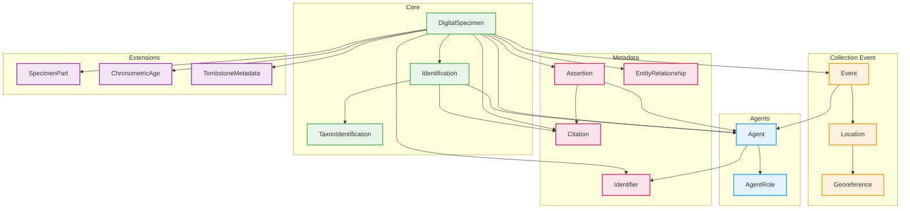
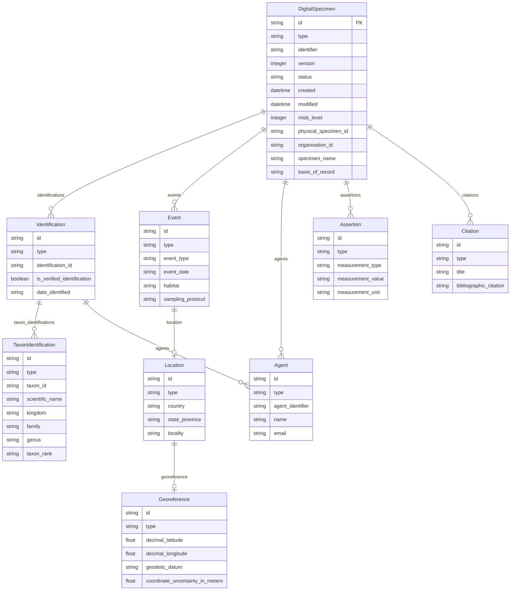

# DiSSCo Digital Specimen v0.4

DiSSCo (Distributed System of Scientific Collections) is a European research infrastructure for natural science collections. The DiSSCo Digital Specimen specification defines a FAIR Digital Object (FDO) format for representing physical specimens in natural science collections as machine-actionable digital objects.

The specification builds on Darwin Core vocabulary while adding DiSSCo-specific extensions for collection management, persistent identifiers, and FAIR compliance. Each Digital Specimen is assigned a DOI and includes MIDS (Minimum Information about a Digital Specimen) level indicators.



## Entities

| Category | Entities |
|----------|----------|
| **Core** | DigitalSpecimen, Identification, TaxonIdentification |
| **Collection Event** | Event, Location, Georeference |
| **Agents** | Agent, AgentRole |
| **Metadata** | Assertion, Citation, Identifier, EntityRelationship |
| **Extensions** | SpecimenPart, ChronometricAge, TombstoneMetadata, RelatedPid |

## Key Concepts

**FAIR Digital Objects**: Each Digital Specimen is a FAIR Digital Object with a DOI identifier, making it globally unique, persistent, and resolvable. The FDO approach ensures specimens are findable, accessible, interoperable, and reusable.

**MIDS Levels**: The Minimum Information about a Digital Specimen (MIDS) framework defines data quality levels from 0-3:

- **MIDS 0**: Digital object exists with basic identifier
- **MIDS 1**: Basic metadata (collection, taxon, geography)
- **MIDS 2**: Extended metadata (coordinates, media links)
- **MIDS 3**: Full metadata including images and detailed provenance

**Organisation Identifiers**: DiSSCo requires organisation identifiers in ROR or Wikidata format, enabling unambiguous linking to collection-holding institutions.

**Topic Classification**: Specimens are classified by:

- `topicOrigin`: Natural, Human-made, Mixed origin
- `topicDomain`: Life, Environment, Earth System, Extraterrestrial
- `topicDiscipline`: Botany, Zoology, Geology, Palaeontology, etc.

**Agent Roles**: People and organisations are represented as Agent entities with typed roles (collector, identifier, creator). Agents can have ORCID identifiers for researchers or ROR identifiers for institutions.

## Validation Rules

The DiSSCo profile includes validation rules for:

- DOI format for specimen identifiers (`^https://doi\.org/.*$`)
- ROR or Wikidata format for organisation identifiers
- MIDS level range (0-3)
- Scientific name required for TaxonIdentification

## Use Cases

- **Collection digitization**: Creating digital representations of physical specimens
- **Data aggregation**: European-wide specimen data infrastructure
- **Linked data**: Connecting specimens to publications, sequences, images
- **Specimen loans**: Digital tracking of physical specimen movements
- **Biodiversity research**: FAIR access to collection data for research

## Entity-Relationship Diagram



## References

| Resource | URL |
|----------|-----|
| DiSSCo Infrastructure | <https://www.dissco.eu/> |
| DiSSCo Schemas | <https://schemas.dissco.tech/> |
| Digital Specimen Schema | <https://schemas.dissco.tech/schemas/fdo-type/digital-specimen/latest/> |
| MIDS Specification | <https://www.tdwg.org/community/cd/mids/> |
| ROR (Research Organization Registry) | <https://ror.org/> |

## Usage

```python
from metaseed import dissco

ds = dissco()

# Create DigitalSpecimen
specimen = ds.DigitalSpecimen(
    id="https://doi.org/10.22/specimen-001",
    type="ods:DigitalSpecimen",
    identifier="https://doi.org/10.22/specimen-001",
    version=1,
    created="2024-06-15T10:00:00Z",
    modified="2024-06-15T10:00:00Z",
    fdo_type="https://doi.org/10.22/fdo-type",
    mids_level=2,
    normalised_physical_specimen_id="NHMD-123456",
    physical_specimen_id="NHMD-123456",
    physical_specimen_id_type="Local",
    source_system_id="https://hdl.handle.net/source-system",
    organisation_id="https://ror.org/00example"
)

# Create Identification
identification = ds.Identification(
    type="ods:Identification",
    is_verified_identification=True,
    date_identified="2024-06-15"
)

# Create TaxonIdentification
taxon = ds.TaxonIdentification(
    type="ods:TaxonIdentification",
    scientific_name="Puma concolor (Linnaeus, 1771)",
    kingdom="Animalia",
    family="Felidae",
    genus="Puma",
    taxon_rank="species"
)
```
