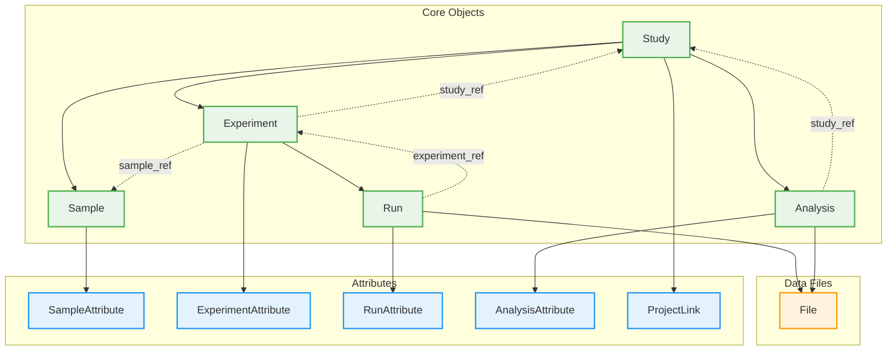
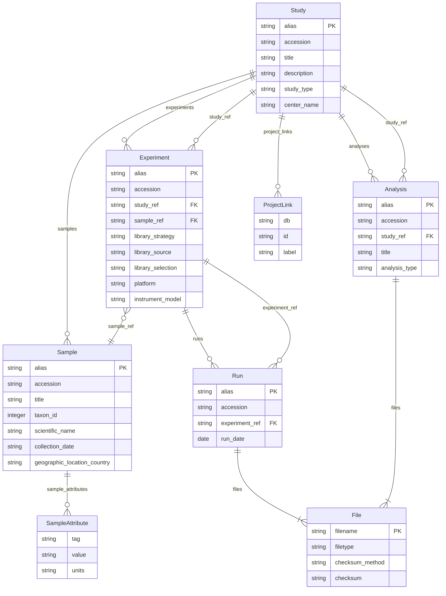

# ENA v1.0

ENA (European Nucleotide Archive) is one of the primary repositories for nucleotide sequence data, operated by EMBL-EBI. The ENA metadata model defines the structure for submitting sequencing projects, samples, experiments, and data files to the archive.

The model is hierarchical: Studies contain Samples and Experiments, Experiments contain Runs with sequence data files, and Analyses contain derived data products. All entities receive ENA accession numbers upon submission.



## Entities

| Category | Entities |
|----------|----------|
| **Core Objects** | Study, Sample, Experiment, Run, Analysis |
| **Data Files** | File |
| **Attributes** | SampleAttribute, ExperimentAttribute, RunAttribute, AnalysisAttribute, ProjectLink |

## Key Concepts

**Study (Project)**: The top-level container that groups related submissions and controls release dates. Studies receive a BioProject accession (PRJEB) or legacy study accession (ERP). All data under a study is released together.

**Sample**: Describes the biological source material being sequenced. Samples are linked to NCBI taxonomy and annotated using ENA checklists (standardized attribute sets). Samples receive BioSample (SAMEA) or sample (ERS) accessions.

**Experiment**: Describes the sequencing library and platform. Key fields include:

- `library_strategy`: Sequencing approach (WGS, RNA-Seq, ChIP-Seq, etc.)
- `library_source`: Material type (GENOMIC, TRANSCRIPTOMIC, METAGENOMIC)
- `library_selection`: Selection method (RANDOM, PCR, PolyA)
- `platform`: Sequencing platform (ILLUMINA, OXFORD_NANOPORE, PACBIO_SMRT)

**Run**: Contains the actual sequence data files (FASTQ, BAM, CRAM). Each run has associated checksums for data integrity verification.

**Analysis**: Contains secondary analysis results derived from runs, such as assemblies, variant calls, or annotations.

## Accession Formats

| Object | Accession Format | Example |
|--------|------------------|---------|
| Study | PRJEB or ERP | PRJEB12345, ERP123456 |
| Sample | ERS or SAMEA | ERS123456, SAMEA123456 |
| Experiment | ERX | ERX123456 |
| Run | ERR | ERR123456 |
| Analysis | ERZ | ERZ123456 |

## Controlled Vocabularies

ENA uses controlled vocabularies for key fields:

**Library Strategy** (37 terms): WGS, WXS, RNA-Seq, ChIP-Seq, ATAC-seq, Hi-C, Bisulfite-Seq, etc.

**Library Source** (9 terms): GENOMIC, TRANSCRIPTOMIC, METAGENOMIC, SYNTHETIC, etc.

**Library Selection** (31 terms): RANDOM, PCR, PolyA, ChIP, MNase, Hybrid Selection, etc.

**Platform** (14 terms): ILLUMINA, OXFORD_NANOPORE, PACBIO_SMRT, ION_TORRENT, etc.

## Validation Rules

The ENA profile includes validation rules for:

- Accession format patterns (PRJEB, ERS, ERX, ERR, ERZ)
- Taxon ID must be positive integer
- MD5 checksum format (32 hexadecimal characters)
- Library vocabulary constraints
- Coordinate ranges for geographic metadata
- Reference integrity between objects

## Use Cases

- **Genome sequencing**: Whole genome sequencing projects
- **Transcriptomics**: RNA-Seq and single-cell RNA-Seq studies
- **Metagenomics**: Environmental and microbiome sequencing
- **Epigenomics**: ChIP-Seq, ATAC-seq, bisulfite sequencing
- **Assemblies**: Genome and transcriptome assembly submission
- **Variant data**: SNP and structural variant submissions

## Entity-Relationship Diagram



## References

| Resource | URL |
|----------|-----|
| ENA Homepage | <https://www.ebi.ac.uk/ena/browser/home> |
| ENA Submission Guide | <https://ena-docs.readthedocs.io/> |
| ENA Metadata Model | <https://ena-docs.readthedocs.io/en/latest/submit/general-guide/metadata.html> |
| Webin XML Schemas | <https://github.com/enasequence/webin-xml> |
| ENA Checklists | <https://www.ebi.ac.uk/ena/browser/checklists> |

## Usage

```python
from metaseed import ena

e = ena()

# Create Study
study = e.Study(
    alias="my-study-001",
    title="Whole genome sequencing of Arabidopsis thaliana ecotypes",
    description="Genomic variation across 100 A. thaliana ecotypes"
)

# Create Sample
sample = e.Sample(
    alias="sample-001",
    title="Arabidopsis thaliana Col-0 leaf tissue",
    taxon_id=3702,
    scientific_name="Arabidopsis thaliana",
    collection_date="2024-06-15",
    geographic_location_country="Germany"
)

# Create Experiment
experiment = e.Experiment(
    alias="experiment-001",
    study_ref="my-study-001",
    sample_ref="sample-001",
    library_strategy="WGS",
    library_source="GENOMIC",
    library_selection="RANDOM",
    library_layout="PAIRED",
    platform="ILLUMINA",
    instrument_model="Illumina NovaSeq 6000"
)

# Create Run with files
run = e.Run(
    alias="run-001",
    experiment_ref="experiment-001",
    run_date="2024-06-20"
)

# Create File
file = e.File(
    filename="sample1_R1.fastq.gz",
    filetype="fastq",
    checksum_method="MD5",
    checksum="d41d8cd98f00b204e9800998ecf8427e"
)
```
