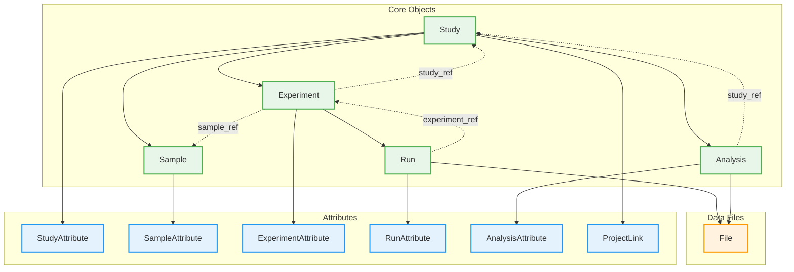
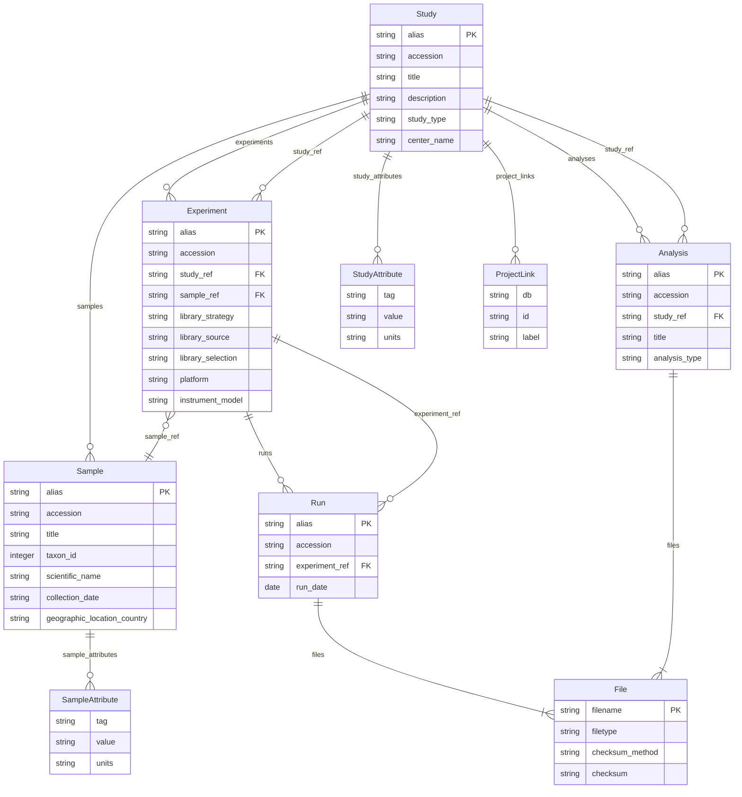

# ENA v1.0

ENA (European Nucleotide Archive) is one of the primary repositories for nucleotide sequence data, operated by EMBL-EBI. The ENA metadata model defines the structure for submitting sequencing projects, samples, experiments, and data files to the archive.

The model is hierarchical: Studies contain Samples and Experiments, Experiments contain Runs with sequence data files, and Analyses contain derived data products. All entities receive ENA accession numbers upon submission.


```mermaid
flowchart TB
    subgraph core["Core Objects"]
        STU[Study]
        SAM[Sample]
        EXP[Experiment]
        RUN[Run]
        ANA[Analysis]
    end

    subgraph files["Data Files"]
        FILE[File]
    end

    subgraph attributes["Attributes"]
        STA[StudyAttribute]
        SA[SampleAttribute]
        EA[ExperimentAttribute]
        RA[RunAttribute]
        AA[AnalysisAttribute]
        PL[ProjectLink]
    end

    %% Core relationships
    STU --> SAM
    STU --> EXP
    STU --> ANA
    EXP --> RUN

    %% References
    EXP -.->|study_ref| STU
    EXP -.->|sample_ref| SAM
    RUN -.->|experiment_ref| EXP
    ANA -.->|study_ref| STU

    %% File relationships
    RUN --> FILE
    ANA --> FILE

    %% Attribute relationships
    STU --> PL
    STU --> STA
    SAM --> SA
    EXP --> EA
    RUN --> RA
    ANA --> AA

    classDef core fill:#e8f5e9,stroke:#4caf50,stroke-width:2px
    classDef file fill:#fff3e0,stroke:#ff9800,stroke-width:2px
    classDef attr fill:#e3f2fd,stroke:#2196f3,stroke-width:2px

    class STU,SAM,EXP,RUN,ANA core
    class FILE file
    class STA,SA,EA,RA,AA,PL attr
```

## Entities

| Category | Entities |
|----------|----------|
| **Core Objects** | Study, Sample, Experiment, Run, Analysis |
| **Data Files** | File |
| **Attributes** | StudyAttribute, SampleAttribute, ExperimentAttribute, RunAttribute, AnalysisAttribute, ProjectLink |

## Key Concepts

**Study (Project)**: The top-level container that groups related submissions and controls release dates. Studies receive a BioProject accession (PRJEB) or legacy study accession (ERP). All data under a study is released together.

**Sample**: Describes the biological source material being sequenced. Samples are linked to NCBI taxonomy and annotated using ENA checklists (standardized attribute sets). Samples receive BioSample (SAMEA) or sample (ERS) accessions.

Attributes such as `collection_date` and `geographic_location_country` are checklist-level requirements (e.g. checklist `ERC000011`), not properties of the base Sample. They are therefore optional on the Sample entity, so valid public ENA/DDBJ records that omit them can be imported. Which attributes a sample must carry depends on the checklist it is registered against; see [How ENA structures a submission](#how-ena-structures-a-submission).

**Experiment**: Describes the sequencing library and platform. Key fields include:

- `library_strategy`: Sequencing approach (WGS, RNA-Seq, ChIP-Seq, etc.)
- `library_source`: Material type (GENOMIC, TRANSCRIPTOMIC, METAGENOMIC)
- `library_selection`: Selection method (RANDOM, PCR, PolyA)
- `platform`: Sequencing platform (ILLUMINA, OXFORD_NANOPORE, PACBIO_SMRT)

**Run**: Contains the actual sequence data files (FASTQ, BAM, CRAM). Each run has associated checksums for data integrity verification.

**Analysis**: Contains secondary analysis results derived from runs, such as assemblies, variant calls, or annotations.

## Accession Formats

| Object | Accession Format | Example |
|--------|------------------|---------|
| Study | PRJEB or ERP | PRJEB12345, ERP123456 |
| Sample | ERS or SAMEA | ERS123456, SAMEA123456 |
| Experiment | ERX | ERX123456 |
| Run | ERR | ERR123456 |
| Analysis | ERZ | ERZ123456 |

## Controlled Vocabularies

ENA uses controlled vocabularies for key fields:

**Library Strategy** (37 terms): WGS, WXS, RNA-Seq, ChIP-Seq, ATAC-seq, Hi-C, Bisulfite-Seq, etc.

**Library Source** (9 terms): GENOMIC, TRANSCRIPTOMIC, METAGENOMIC, SYNTHETIC, etc.

**Library Selection** (31 terms): RANDOM, PCR, PolyA, ChIP, MNase, Hybrid Selection, etc.

**Platform** (14 terms): ILLUMINA, OXFORD_NANOPORE, PACBIO_SMRT, ION_TORRENT, etc.

## How ENA structures a submission

ENA separates what is the same for every submission from what depends on the kind of material sequenced.

**The generic part** is the object model above. A submission registers a Study, one Sample per piece of source material, one Experiment per library and platform, one Run per set of data files and, for derived results, Analyses. These objects have the same fields for a bacterial isolate, a maize leaf and a litre of seawater. They are submitted as XML documents (`study.xml`, `sample.xml`, `experiment.xml`, `run.xml`, `analysis.xml`) under one `submission.xml` naming the actions, which is what `to_ena_xml` produces, and they receive accessions in the formats listed below.

**The domain-specific part** is the **sample checklist**. A Sample carries, besides its taxon, title and description, a list of attributes (tag, value, optional units), and ENA registers each sample against one checklist that says which attributes it must and may carry. ENA publishes 48 checklists, each as XML at `https://www.ebi.ac.uk/ena/browser/api/xml/<id>`; the submission names the checklist in the sample's attributes (`ENA-CHECKLIST`), which the profile holds in `Sample.checklist`. A sample that names none is registered against the default, `ERC000011`.

| Checklist | For | Attributes | Mandatory |
|-----------|-----|------------|-----------|
| ERC000011 | default | 30 | collection date, country or sea |
| ERC000028 | prokaryotic pathogen | 20 | isolation source, host health state, host scientific name, isolate, collection date, country or sea |
| ERC000033 | virus pathogen | 36 | 10, among them host, host health state, isolate, collection date, country or sea |
| ERC000037 | plant | 99 | developmental stage, plant structure, growth medium, isolation and growth condition, latitude, longitude, collection date, country or sea |
| ERC000035 | crop plant, enhanced annotation | 36 | 2 |
| ERC000022 | GSC MIxS soil | 109 | 10 |
| ERC000024 | GSC MIxS water | 134 | 9 |
| ERC000050 | binned metagenome | 52 | 14 |
| ERC000053 | Tree of Life | 42 | 10 |

The GSC MIxS family (`ERC000012` to `ERC000025`, `ERC000031`, `ERC000055` to `ERC000058`) covers environments for microbiome studies; the others are ENA's own or a consortium's reporting standard. Across all 48 there are 1,023 distinct attribute names; `collection_date`, `geographic_location_country_andor_sea`, `geographic_location_latitude` and `geographic_location_longitude` appear in nearly every one, so a sample's location and date are effectively universal, while `plant_structure` or `host_health_state` belong to one domain.

A checklist defines four things for each attribute, and ENA validates a submission against all four:

1. **Tier**: `mandatory`, `recommended` or `optional`. A sample missing a mandatory attribute is rejected; a recommended one is asked for but not enforced.
2. **Allowed values** for a `TEXT_CHOICE_FIELD`: the country-or-sea list (about 290 values), `plant_structure`, `host_health_state` (six values), yes-or-no fields. Of the 3,486 attribute definitions across the 48 checklists, 332 carry such a list.
3. **Pattern** for a `TEXT_FIELD` that has one: ENA's date formats for `collection_date`, decimal patterns for coordinates, digits for a taxon id.
4. **Units**: the units an attribute accepts (`depth` in m, `shell_length` in mm), carried in the attribute's units slot.

The attribute name is matched exactly, so a tag written as `plant structure` does not satisfy a checklist asking for `plant_structure`.

**How this maps onto the profile.** The generic objects are the profile's entities, and a checklist attribute is a `SampleAttribute` with the checklist's tag, which is how the importer records them (every column ENA publishes for a sample, see [ENA Integration](../architecture/ena-import.md)) and how the exporter writes them. The profile declares the attributes common to nearly every checklist as fields on `Sample` (`collection_date`, `geographic_location_country`, `lat_lon_latitude`, `lat_lon_longitude`, `isolation_source`, `host`, ...), each with its pattern or vocabulary on the field itself, which is where metaseed expresses such a constraint: there is no checklist mechanism in the specification language, a requirement is a field with `required`, a `pattern` or an `enum`. Which of a checklist's attributes are mandatory is therefore not enforced by the profile today; a submission is validated against its checklist by ENA at submission time. The validation rules below cover the generic part.

## Validation Rules

The ENA profile includes validation rules for:

- Accession format patterns (PRJEB, ERS, ERX, ERR, ERZ)
- Taxon ID must be positive integer
- MD5 checksum format (32 hexadecimal characters)
- Library vocabulary constraints
- Coordinate ranges for geographic metadata
- Reference integrity between objects

## Use Cases

- **Genome sequencing**: Whole genome sequencing projects
- **Transcriptomics**: RNA-Seq and single-cell RNA-Seq studies
- **Metagenomics**: Environmental and microbiome sequencing
- **Epigenomics**: ChIP-Seq, ATAC-seq, bisulfite sequencing
- **Assemblies**: Genome and transcriptome assembly submission
- **Variant data**: SNP and structural variant submissions

## Entity-Relationship Diagram


```mermaid
erDiagram
    Study {
        string alias PK
        string accession
        string title
        string description
        string study_type
        string center_name
    }

    Sample {
        string alias PK
        string accession
        string title
        integer taxon_id
        string scientific_name
        string collection_date
        string geographic_location_country
    }

    Experiment {
        string alias PK
        string accession
        string study_ref FK
        string sample_ref FK
        string library_strategy
        string library_source
        string library_selection
        string platform
        string instrument_model
    }

    Run {
        string alias PK
        string accession
        string experiment_ref FK
        date run_date
    }

    Analysis {
        string alias PK
        string accession
        string study_ref FK
        string title
        string analysis_type
    }

    File {
        string filename PK
        string filetype
        string checksum_method
        string checksum
    }

    StudyAttribute {
        string tag
        string value
        string units
    }

    SampleAttribute {
        string tag
        string value
        string units
    }

    ProjectLink {
        string db
        string id
        string label
    }

    Study ||--o{ Sample : samples
    Study ||--o{ Experiment : experiments
    Study ||--o{ Analysis : analyses
    Study ||--o{ ProjectLink : project_links
    Study ||--o{ StudyAttribute : study_attributes
    Experiment ||--o{ Run : runs
    Experiment }o--|| Study : study_ref
    Experiment }o--|| Sample : sample_ref
    Run }o--|| Experiment : experiment_ref
    Run ||--|{ File : files
    Analysis }o--|| Study : study_ref
    Analysis ||--|{ File : files
    Sample ||--o{ SampleAttribute : sample_attributes
```

## References

| Resource | URL |
|----------|-----|
| ENA Homepage | <https://www.ebi.ac.uk/ena/browser/home> |
| ENA Submission Guide | <https://ena-docs.readthedocs.io/> |
| ENA Metadata Model | <https://ena-docs.readthedocs.io/en/latest/submit/general-guide/metadata.html> |
| Webin XML Schemas | <https://github.com/enasequence/webin-xml> |
| ENA Checklists | <https://www.ebi.ac.uk/ena/browser/checklists> |

## Usage

```python
from metaseed import ena

e = ena()

# Create Study
study = e.Study(
    alias="my-study-001",
    title="Whole genome sequencing of Arabidopsis thaliana ecotypes",
    description="Genomic variation across 100 A. thaliana ecotypes"
)

# Create Sample
sample = e.Sample(
    alias="sample-001",
    title="Arabidopsis thaliana Col-0 leaf tissue",
    taxon_id=3702,
    scientific_name="Arabidopsis thaliana",
    collection_date="2024-06-15",
    geographic_location_country="Germany"
)

# Create Experiment
experiment = e.Experiment(
    alias="experiment-001",
    study_ref="my-study-001",
    sample_ref="sample-001",
    library_strategy="WGS",
    library_source="GENOMIC",
    library_selection="RANDOM",
    library_layout="PAIRED",
    platform="ILLUMINA",
    instrument_model="Illumina NovaSeq 6000"
)

# Create Run with files
run = e.Run(
    alias="run-001",
    experiment_ref="experiment-001",
    run_date="2024-06-20"
)

# Create File
file = e.File(
    filename="sample1_R1.fastq.gz",
    filetype="fastq",
    checksum_method="MD5",
    checksum="d41d8cd98f00b204e9800998ecf8427e"
)
```
