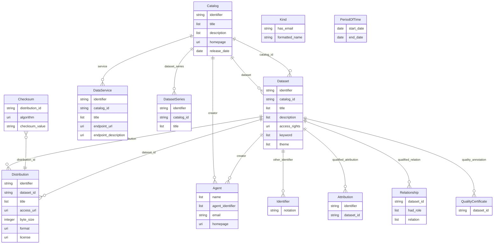

# Health-RI Core v2.0

The `health-ri-core` profile is the Health-RI core metadata schema, version 2.0.3, which the Dutch National Health Data Catalogue uses to describe datasets, their distributions and the services that serve them. It is a DCAT application profile: DCAT-AP 3, DCAT-AP NL and HealthDCAT-AP, as the SHACL shapes and the requirement spreadsheet in the [health-ri-metadata](https://github.com/Health-RI/health-ri-metadata) repository define them. Cardinality follows the shapes; whether a field is required, recommended or optional follows the spreadsheet.

A **`Catalog`** is the root. It names its publisher and contact point, and owns its datasets, dataset series and data services. A **`Dataset`** owns its distributions, identifiers, attributions, relationships, quality certificates and retention period, and names the catalogue it belongs to in `catalog_id`; a **`Distribution`** names its dataset in `dataset_id` and owns its checksum. Agents (an organisation or a person), contact details (`Kind`), periods and identifiers are value entities nested where they are used. Most text fields are lists, because DCAT allows a title or a description per language; most controlled values are IRIs from the EU vocabularies, DPV, IANA and SPDX.

## Entities

| Category | Entities |
|----------|----------|
| **Catalogue** | Catalog, DatasetSeries |
| **Data** | Dataset, Distribution, DataService |
| **Provenance** | Agent, Attribution, Relationship, QualityCertificate, Identifier |
| **Values** | Kind, PeriodOfTime, Checksum |

## Entity-Relationship Diagram



## Usage

```python
from metaseed import health_ri_core

h = health_ri_core()

catalog = h.Catalog(
    identifier="https://example.org/catalog/example-umc-research",
    title=["Example UMC research data catalogue"],
    description=["Datasets of the Example University Medical Centre."],
    contact_point={"has_email": "datadesk@example.org", "formatted_name": "Example UMC Research Data Desk"},
    publisher={
        "name": ["Example University Medical Centre"],
        "agent_identifier": ["https://ror.org/00000example"],
        "email": "info@example.org",
        "homepage": "https://example.org",
    },
)
```

## References

| Resource | URL |
|----------|-----|
| Health-RI metadata schema | <https://github.com/Health-RI/health-ri-metadata> |
| National Health Data Catalogue | <https://www.health-ri.nl/en/services/national-health-data-catalogue> |
| HealthDCAT-AP | <https://healthdcat-ap.github.io/> |
| DCAT-AP 3 | <https://semiceu.github.io/DCAT-AP/releases/3.0.0/> |
