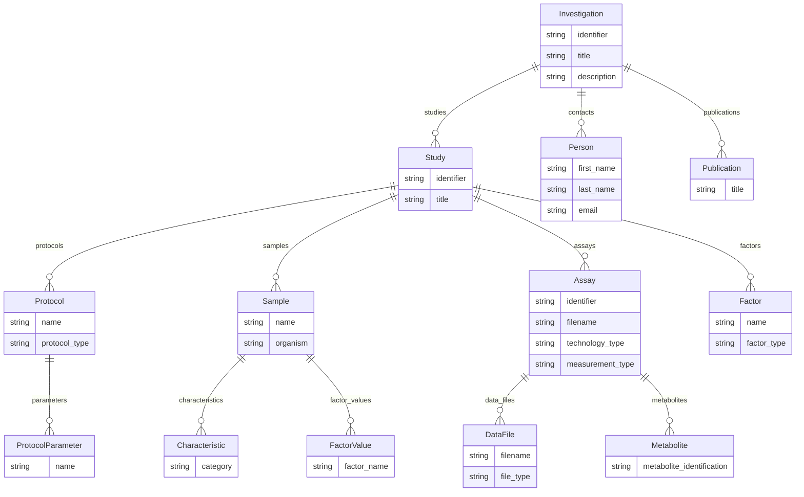

# MetaboLights v1.0

The `metabolights` profile models a metabolomics study for submission to
[MetaboLights](https://www.ebi.ac.uk/metabolights/). It follows the ISA
(Investigation → Study → Assay) structure, with **`Investigation`** as the root
entity. A single merged `Assay` entity covers both mass-spectrometry and
NMR technologies, differentiated by its populated fields rather than by a
subtype.

## Entities

| Entity | Role |
|--------|------|
| `Investigation` | Root — the overall project, its contacts and studies |
| `Study` | A study with its protocols, factors, samples and assays |
| `Assay` | An analytical run (MS or NMR), its measurement/technology types |
| `Sample` | A biological sample with organism and characteristics |
| `Protocol` | A named protocol (e.g. extraction) with parameters |
| `ProtocolParameter` | A parameter of a protocol |
| `Factor` | A study factor (independent variable) |
| `FactorValue` | A factor's value on a sample |
| `Characteristic` | A sample characteristic (category + value) |
| `Metabolite` | An identified metabolite (assignment) |
| `DataFile` | A raw/derived data file |
| `Person` | An investigation/study contact |
| `Publication` | An associated publication |

## Entity-Relationship Diagram



## Usage

```python
from metaseed import metabolights

m = metabolights()

sample = {"name": "S1", "organism": "Homo sapiens"}

investigation = m.Investigation(
    identifier="MTBLS1",
    title="Example metabolomics investigation",
    description="A demonstration MetaboLights investigation for the profile docs.",
    contacts=[{"first_name": "Jane", "last_name": "Doe", "email": "jane@example.org"}],
    studies=[
        {
            "identifier": "s_MTBLS1",
            "title": "Study 1",
            "protocols": [{"name": "Extraction", "protocol_type": "extraction"}],
            "samples": [sample],
            "assays": [
                {
                    "identifier": "a_MTBLS1",
                    "filename": "a_mtbls1.txt",
                    "technology_type": "mass spectrometry",
                    "measurement_type": "metabolite profiling",
                    "samples": [sample],
                }
            ],
        }
    ],
)
```

## References

| Resource | URL |
|----------|-----|
| MetaboLights | <https://www.ebi.ac.uk/metabolights/> |
| ISA framework | <https://isa-tools.org/> |
