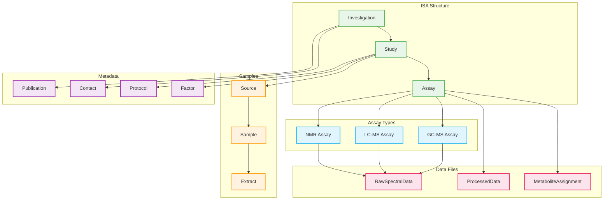
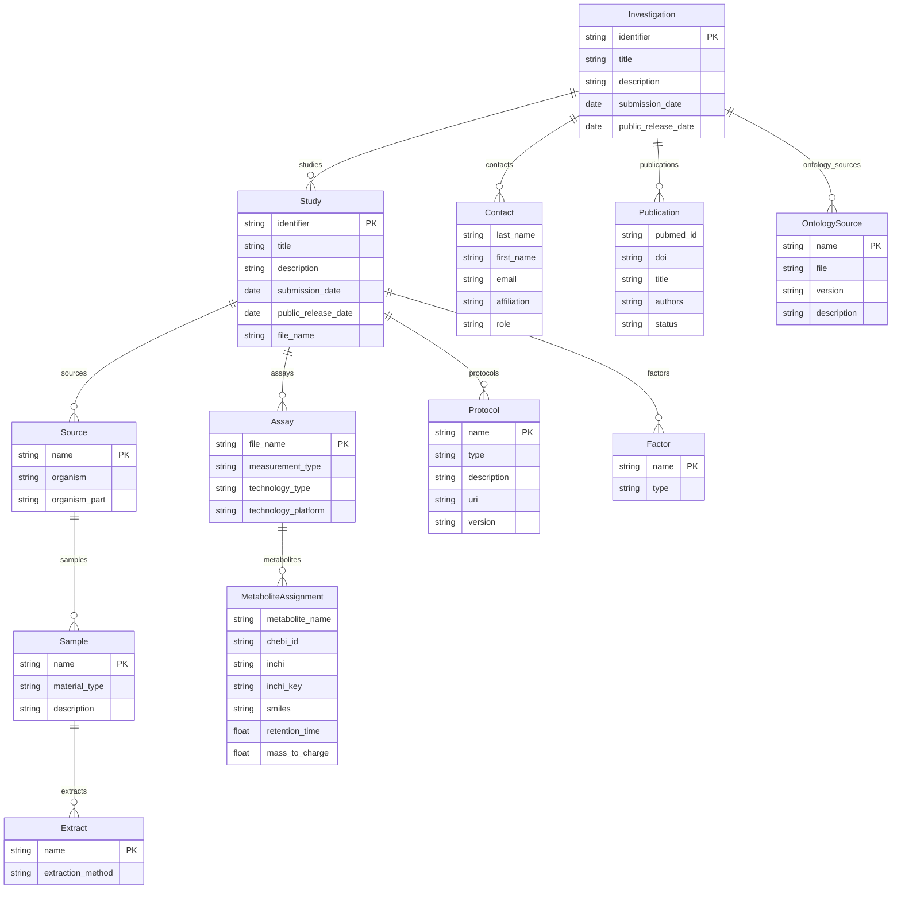

# MetaboLights

MetaboLights is the database for metabolomics experiments and derived information, hosted by EMBL-EBI. It is the recommended repository for metabolomics data by major journals and funding agencies.

MetaboLights uses the ISA-Tab format (Investigation/Study/Assay) for metadata organization, extended with metabolomics-specific assay types for NMR spectroscopy, liquid chromatography-mass spectrometry (LC-MS), and gas chromatography-mass spectrometry (GC-MS).



## Entities

| Category | Entities |
|----------|----------|
| **ISA Structure** | Investigation, Study, Assay |
| **Samples** | Source, Sample, Extract |
| **Assay Types** | NMRAssay, LCMSAssay, GCMSAssay |
| **Data Files** | RawSpectralData, ProcessedData, MetaboliteAssignment |
| **Metadata** | Publication, Contact, Protocol, Factor, OntologySource |

## Key Concepts

**Investigation**: The top-level container grouping related studies. Includes submission metadata, contacts, and publications. Investigations receive MTBLS accessions.

**Study**: Describes the experimental design. Contains:

- `identifier`: Unique study identifier
- `title`: Descriptive study title
- `description`: Full study description
- `factors`: Experimental variables being tested
- `protocols`: Experimental procedures used

**Assay**: Links samples to data files through a specific measurement technology. MetaboLights supports three primary assay types.

**Source**: The original biological material (organism, cell line, tissue).

**Sample**: A portion of the source material that undergoes sample preparation.

**Extract**: The processed material ready for analysis (e.g., metabolite extract).

## Assay Types

### NMR Assay

Nuclear Magnetic Resonance spectroscopy assay. Key parameters:

- `instrument`: NMR spectrometer model
- `pulse_sequence`: Acquisition sequence (NOESY, CPMG, etc.)
- `magnetic_field_strength`: Field strength in MHz
- `acquisition_nucleus`: Observed nucleus (1H, 13C, etc.)
- `temperature`: Sample temperature during acquisition

### LC-MS Assay

Liquid Chromatography-Mass Spectrometry assay. Key parameters:

- `chromatography_instrument`: LC system model
- `column_type`: Chromatographic column specification
- `ms_instrument`: Mass spectrometer model
- `ionization_mode`: ESI positive/negative, APCI
- `mass_analyzer`: Orbitrap, TOF, Quadrupole
- `scan_polarity`: Positive, negative, or alternating

### GC-MS Assay

Gas Chromatography-Mass Spectrometry assay. Key parameters:

- `gc_instrument`: GC system model
- `column_type`: GC column specification
- `ms_instrument`: Mass spectrometer model
- `ionization_mode`: EI, CI
- `derivatization_method`: Chemical derivatization used

## Accession Formats

| Object | Accession Format | Example |
|--------|------------------|---------|
| Study | MTBLS | MTBLS1234 |

## Controlled Vocabularies

MetaboLights uses established ontologies per Metabolomics Standards Initiative (MSI) recommendations:

**Organisms**: NCBI Taxonomy

**Anatomy/Tissue**: UBERON ontology

**Cell Types**: Cell Ontology (CL)

**Diseases**: Human Disease Ontology (DOID), MONDO

**Chemicals/Metabolites**: ChEBI (Chemical Entities of Biological Interest)

**Instrument Terms**: PSI-MS ontology for mass spectrometry

**NMR Terms**: NMR-STAR dictionary, nmrCV

**Units**: Unit Ontology (UO)

## Metabolite Annotation

MetaboLights requires metabolite identification using standardized identifiers:

| Identifier | Description | Example |
|------------|-------------|---------|
| ChEBI ID | Chemical Entities of Biological Interest | CHEBI:15377 |
| InChI | International Chemical Identifier | InChI=1S/H2O/h1H2 |
| InChIKey | Hashed InChI for searching | XLYOFNOQVPJJNP-UHFFFAOYSA-N |
| SMILES | Structural formula notation | O |
| HMDB ID | Human Metabolome Database | HMDB0000001 |
| PubChem CID | PubChem Compound ID | 962 |

## File Types

| File Type | Extensions | Description |
|-----------|------------|-------------|
| NMR Raw | .zip (Bruker), .jdx | Raw NMR FID data |
| MS Raw | .raw, .mzML, .mzXML | Raw MS data |
| Processed | .xlsx, .csv, .tsv | Quantification matrices |
| MAF | m_*.tsv | Metabolite Assignment File |
| ISA-Tab | i_*.txt, s_*.txt, a_*.txt | Metadata files |

## Entity-Relationship Diagram



## Validation Rules

The MetaboLights profile includes validation rules per MSI recommendations:

- Valid MTBLS accession format
- At least one contact with valid email
- Organism must be valid NCBI taxonomy
- Metabolite identifiers should include ChEBI ID or InChI
- Required protocol descriptions for sample collection, extraction, and analysis
- Mass spectrometry parameters must use PSI-MS terms
- Retention time and m/z values required for MS-based identification

## MSI Reporting Levels

Metabolite identification confidence levels:

| Level | Description |
|-------|-------------|
| Level 1 | Identified compound (reference standard match) |
| Level 2 | Putatively annotated compound (spectral library match) |
| Level 3 | Putatively characterized compound class |
| Level 4 | Unknown compound |

## Use Cases

- **Untargeted metabolomics**: Discovery-based profiling studies
- **Targeted metabolomics**: Quantitative analysis of specific metabolites
- **Lipidomics**: Lipid profiling and identification
- **Fluxomics**: Metabolic flux analysis with stable isotope tracers
- **Clinical metabolomics**: Biomarker discovery and validation
- **Plant metabolomics**: Natural product and secondary metabolite studies
- **Exposomics**: Environmental exposure assessment

## References

| Resource | URL |
|----------|-----|
| MetaboLights Homepage | <https://www.ebi.ac.uk/metabolights/> |
| MetaboLights Help | <https://www.ebi.ac.uk/metabolights/help> |
| MetaboLights Submission | <https://www.ebi.ac.uk/metabolights/editor/> |
| ISA-Tab Specification | <https://isa-specs.readthedocs.io/en/latest/isatab.html> |
| MSI Guidelines | <https://www.metabolomics-msi.org/> |
| ChEBI Ontology | <https://www.ebi.ac.uk/chebi/> |
| MetaboLights GitHub | <https://github.com/EBI-Metabolights> |

## Relation to ISA Profile

MetaboLights submissions are ISA-Tab format with metabolomics-specific extensions. The existing ISA profile provides the base structure; this MetaboLights profile adds:

1. Metabolomics-specific assay types (NMR, LC-MS, GC-MS)
2. Metabolite Assignment File (MAF) entity
3. ChEBI and metabolite identifier fields
4. MSI-recommended controlled vocabularies
5. Spectral data file type definitions

## Usage

```python
from metaseed import metabolights

m = metabolights()

# Create Investigation
investigation = m.Investigation(
    identifier="MTBLS001",
    title="Metabolomic profiling of plant stress response",
    description="LC-MS based metabolomics of Arabidopsis under drought stress"
)

# Create Study
study = m.Study(
    identifier="s_study1",
    title="Arabidopsis drought stress metabolomics",
    description="Time-course metabolite profiling under water deficit"
)

# Create Source (organism)
source = m.Source(
    name="Arabidopsis_Col0",
    organism="Arabidopsis thaliana",
    organism_part="leaf"
)

# Create Sample
sample = m.Sample(
    name="drought_24h_rep1",
    material_type="tissue extract",
    description="Leaf tissue after 24h drought treatment"
)

# Create LC-MS Assay
assay = m.LCMSAssay(
    file_name="a_lcms_positive.txt",
    measurement_type="metabolite profiling",
    technology_type="mass spectrometry",
    chromatography_instrument="Thermo Vanquish UHPLC",
    column_type="C18 reverse phase",
    ms_instrument="Thermo Q Exactive HF",
    ionization_mode="electrospray ionization",
    scan_polarity="positive"
)

# Create Metabolite Assignment
metabolite = m.MetaboliteAssignment(
    metabolite_name="proline",
    chebi_id="CHEBI:17203",
    inchi="InChI=1S/C5H9NO2/c7-5(8)4-2-1-3-6-4/h4,6H,1-3H2,(H,7,8)",
    retention_time=1.23,
    mass_to_charge=116.0706
)

# Create Contact
contact = m.Contact(
    first_name="Jane",
    last_name="Doe",
    email="jane.doe@example.org",
    affiliation="University of Example",
    role="principal investigator"
)

# Create Protocol
extraction_protocol = m.Protocol(
    name="metabolite_extraction",
    type="Extraction",
    description="Metabolites extracted with 80% methanol at -20C"
)
```
