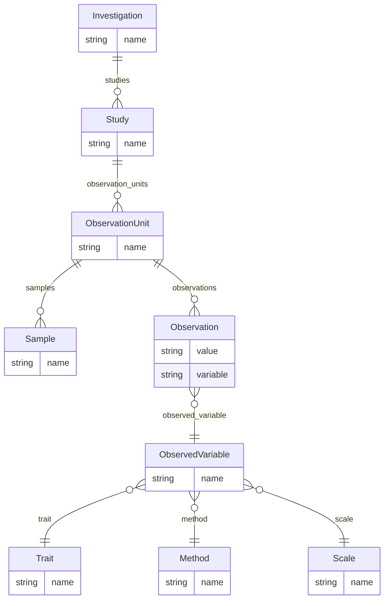

# MIAPPE-HTP v1.0

The `miappe-htp` profile is a high-throughput-phenotyping variant of MIAPPE. It
keeps the MIAPPE investigation/study backbone but expands the model to 28
entities that capture observation levels, spatial layout, growth facilities and
the trait/method/scale decomposition of observed variables. Entities are keyed by
`name`, and the root entity is **`Investigation`**.

## Entities

| Category | Entities |
|----------|----------|
| **Backbone** | Investigation, Study |
| **Material** | BiologicalMaterial, MaterialSource, Sample |
| **Observation** | ObservationUnit, ObservationLevel, ObservationLevelHierarchy, Observation, ObservedVariable, Trait, Method, Scale |
| **Design** | ExperimentalDesign, Factor, FactorValue |
| **Environment** | Environment, EnvironmentParameter, GrowthFacility, Event |
| **Layout** | Location, Country, SpatialDistribution, SpatialDistributionType |
| **People** | Person, Role, Institution |
| **Data** | DataFile |

## Entity-Relationship Diagram



## Usage

```python
from metaseed import miappe_htp

h = miappe_htp()

investigation = h.Investigation(name="Wheat high-throughput phenotyping investigation")
```

## References

| Resource | URL |
|----------|-----|
| MIAPPE | <https://www.miappe.org/> |
