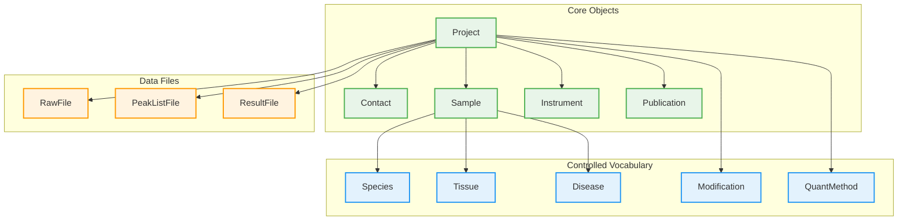
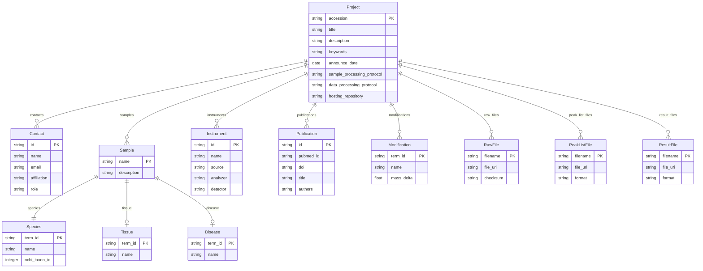

# PRIDE (ProteomeXchange)

PRIDE (PRoteomics IDEntifications Database) is the world's largest public repository for proteomics data, hosted by EMBL-EBI. It is part of the ProteomeXchange consortium which standardizes proteomics data submission across multiple repositories.

The ProteomeXchange metadata model defines the structure for submitting mass spectrometry proteomics datasets. Projects receive PXD accessions and contain sample descriptions, instrument configurations, publications, and data files.



## Entities

| Category | Entities |
|----------|----------|
| **Core Objects** | Project, Contact, Sample, Instrument, Publication |
| **Data Files** | RawFile, PeakListFile, ResultFile |
| **Controlled Vocabulary** | Species, Tissue, Disease, Modification, QuantMethod |

## Key Concepts

**Project (Dataset)**: The top-level container for a proteomics submission. Projects receive PXD accessions (e.g., PXD012345) and control data release. Key fields include:

- `title`: Descriptive project title
- `description`: Full project description
- `keywords`: Comma-separated keywords for discovery
- `sample_processing_protocol`: How samples were prepared
- `data_processing_protocol`: How data was analyzed

**Contact**: Principal investigator and submitter information. At least one contact with email is required. Contacts can have roles (submitter, principal investigator, lab head).

**Sample**: Describes the biological material analyzed. Samples are annotated with controlled vocabulary terms:

- `species`: NCBI taxonomy (required)
- `tissue`: BRENDA tissue ontology (required, "not applicable" if N/A)
- `cell_type`: Cell line or cell type (optional)
- `disease`: Disease state or "normal" (optional)

**Instrument**: Mass spectrometer configuration using PSI-MS ontology terms:

- `name`: Instrument name from controlled vocabulary
- `source`: Ionization source (ESI, MALDI, etc.)
- `analyzer`: Mass analyzer (Orbitrap, TOF, Quadrupole)
- `detector`: Detection method

**Publication**: Associated papers with PubMed IDs or DOIs.

## Accession Formats

| Object | Accession Format | Example |
|--------|------------------|---------|
| Project | PXD | PXD012345 |
| Reviewer access | RPXD | RPXD012345 |

## Controlled Vocabularies

ProteomeXchange uses the PSI-MS ontology and related controlled vocabularies:

**Species**: NCBI Taxonomy identifiers (e.g., 9606 for Homo sapiens)

**Tissue**: BRENDA Tissue Ontology (BTO) terms (e.g., BTO:0000759 for liver)

**Disease**: Human Disease Ontology (DOID) or MONDO terms

**Modifications**: PSI-MOD or UNIMOD identifiers for post-translational modifications

**Quantification Methods**: PSI-MS terms for quantification approaches (label-free, TMT, SILAC, iTRAQ)

**Instrument Terms**: PSI-MS ontology for mass spectrometry instruments and components

## Submission Types

**Complete submission**: All identification results included (mzIdentML or mzTab)

**Partial submission**: Raw data only, no identification results

## File Types

| File Type | Extensions | Description |
|-----------|------------|-------------|
| Raw data | .raw, .wiff, .d | Vendor-specific raw files |
| Peak lists | .mgf, .mzML, .mzXML | Processed spectra |
| Results | .mzIdentML, .mzTab | Identification/quantification results |
| Search | .dat, .xml | Search engine output |

## Entity-Relationship Diagram



## Validation Rules

The PRIDE profile includes validation rules for:

- PXD accession format pattern (PXD followed by 6 digits)
- At least one contact with valid email required
- Species is mandatory for all samples
- Tissue required (use "not applicable" for non-tissue samples)
- Valid PSI-MS ontology terms for instruments
- MD5 or SHA-256 checksums for data files
- At least one raw file required

## Use Cases

- **Shotgun proteomics**: DDA and DIA identification experiments
- **Quantitative proteomics**: TMT, iTRAQ, SILAC, label-free quantification
- **PTM analysis**: Phosphoproteomics, ubiquitinomics, glycoproteomics
- **Protein-protein interactions**: AP-MS, cross-linking MS
- **Clinical proteomics**: Biomarker discovery studies
- **Metaproteomics**: Microbiome protein analysis

## References

| Resource | URL |
|----------|-----|
| PRIDE Homepage | <https://www.ebi.ac.uk/pride/> |
| PRIDE Submission | <https://www.ebi.ac.uk/pride/markdownpage/submitdatapage> |
| ProteomeXchange | <https://www.proteomexchange.org/> |
| PX Guidelines | <https://www.proteomexchange.org/docs/guidelines_px.pdf> |
| PX XML Schema | <https://proteomecentral.proteomexchange.org/schemas/proteomeXchange-1.4.0.xsd> |
| PSI-MS Ontology | <https://www.ebi.ac.uk/ols/ontologies/ms> |
| PRIDE GitHub | <https://github.com/PRIDE-Archive> |

## Usage

```python
from metaseed import pride

p = pride()

# Create Project
project = p.Project(
    title="Quantitative proteomics of human liver tissue",
    description="TMT-based quantitative proteomics comparing healthy vs diseased liver",
    keywords="liver, proteomics, TMT, quantitative",
    sample_processing_protocol="Proteins extracted with RIPA buffer, digested with trypsin",
    data_processing_protocol="MaxQuant 2.0 with 1% FDR"
)

# Create Contact
contact = p.Contact(
    name="John Smith",
    email="john.smith@example.org",
    affiliation="University of Example",
    role="principal investigator"
)

# Create Sample with CV terms
sample = p.Sample(
    name="healthy_liver_01",
    description="Healthy human liver biopsy"
)

species = p.Species(
    term_id="NCBITaxon:9606",
    name="Homo sapiens",
    ncbi_taxon_id=9606
)

tissue = p.Tissue(
    term_id="BTO:0000759",
    name="liver"
)

# Create Instrument
instrument = p.Instrument(
    name="Q Exactive HF",
    source="electrospray ionization",
    analyzer="orbitrap",
    detector="inductive detector"
)

# Create Publication
publication = p.Publication(
    pubmed_id="12345678",
    doi="10.1234/example.2024.001",
    title="Liver proteomics reveals disease signatures"
)

# Create Files
raw_file = p.RawFile(
    filename="sample01.raw",
    file_uri="ftp://ftp.pride.ebi.ac.uk/sample01.raw",
    checksum="d41d8cd98f00b204e9800998ecf8427e"
)
```
