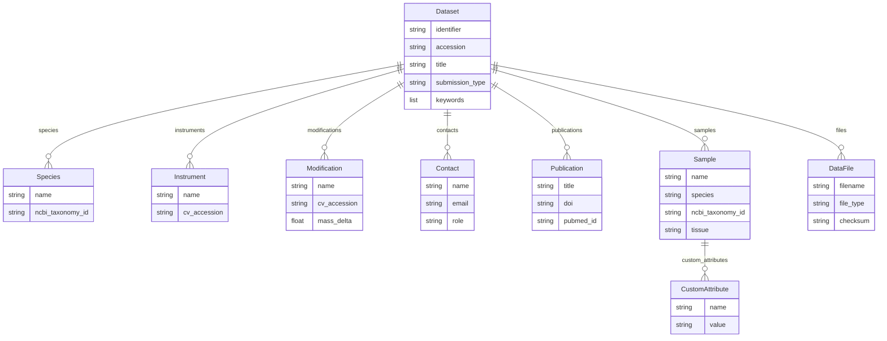

# PRIDE v1.0

The `pride` profile models a proteomics dataset for submission to
[PRIDE](https://www.ebi.ac.uk/pride/) / ProteomeXchange. Its root entity is
**`Dataset`**, which carries the submission-level metadata and nests the samples,
data files, instruments, modifications, contacts, publications and species that
describe a proteomics experiment.

## Entities

| Entity | Role |
|--------|------|
| `Dataset` | Root — submission metadata (identifier, title, protocols, keywords) |
| `Sample` | A biological sample, with species/tissue/disease annotations |
| `Species` | An organism the dataset covers (name + NCBI taxonomy id) |
| `Instrument` | A mass spectrometer, referenced by a PSI-MS CV accession |
| `Modification` | A protein/peptide modification (PSI-MOD/UNIMOD accession) |
| `Publication` | An associated publication (DOI / PubMed id) |
| `Contact` | A submitter, lab head or principal investigator |
| `DataFile` | A raw/peak/result file, optionally linked to samples |
| `CustomAttribute` | A free `name`/`value` annotation on a sample |

`Publication` is keyed by its `title` in 1.0, because nothing declares an
identifier and the first field is what inference falls back to. Its identifier is
the `doi`. Moving it changes what existing datasets are keyed by, so it belongs
in a MAJOR version rather than a patch; until then the spec-builder advisory
reports the weakness, which is accurate.

## Entity-Relationship Diagram



## Usage

```python
from metaseed import pride

p = pride()

dataset = p.Dataset(
    identifier="PXD000001",
    accession="PXD000001",
    title="Example proteomics dataset",
    description=(
        "A demonstration ProteomeXchange proteomics dataset submission record."
    ),
    sample_processing_protocol=(
        "Proteins were reduced, alkylated and digested with trypsin overnight."
    ),
    data_processing_protocol=(
        "Raw files were searched with MaxQuant against the reference proteome."
    ),
    submission_type="COMPLETE",
    keywords=["proteomics", "mass spectrometry"],
    species=[{"name": "Homo sapiens", "ncbi_taxonomy_id": "9606"}],
    instruments=[{"name": "LTQ Orbitrap", "cv_accession": "MS:1000449"}],
    contacts=[
        {
            "name": "Jane Doe",
            "email": "jane@example.org",
            "affiliation": "Example University",
            "role": "submitter",
        }
    ],
    samples=[{"name": "S1", "species": "Homo sapiens", "ncbi_taxonomy_id": "9606"}],
    files=[{"filename": "run1.raw", "file_type": "RAW"}],
)
```

## References

| Resource | URL |
|----------|-----|
| PRIDE Archive | <https://www.ebi.ac.uk/pride/> |
| ProteomeXchange | <https://www.proteomexchange.org/> |
| PSI-MS controlled vocabulary | <https://www.ebi.ac.uk/ols4/ontologies/ms> |
