# REMBI v1.5

The `rembi` profile is the Recommended Metadata for Biological Images, version 1.5, as the [BioImage Archive](https://www.ebi.ac.uk/bioimage-archive/) implements it for a submission. A **`Study`** is the root: what was imaged and why, who did it, how it is licensed and funded. The study owns its biosamples, specimens and image acquisitions, and optionally the image correlation, image analysis and annotation modules. A **`StudyComponent`** associates one biosample, one specimen and one image acquisition by title, as a BioImage Archive submission does, states the REMBI version it follows, and lists the image files that belong to that combination. An **`Annotation`** may name its own authors and carry per-file metadata (**`FileLevelMetadata`**: which image a file annotates, what kind of annotation it holds, how it was derived).

Every entity below the study names its study in `study_id`, and a study component names the biosample, specimen and acquisition it combines by their `title`. The imaging method is a term of the Biological Imaging Methods Ontology (FBbi); the organism is an NCBI Taxonomy identifier.

## Entities

| Category | Entities |
|----------|----------|
| **Study** | Study, Author, Publication, Link, GrantReference |
| **What was imaged** | Biosample, Specimen |
| **How it was imaged** | ImageAcquisition, ImageCorrelation |
| **What was done with the images** | ImageAnalysis, Annotation, FileLevelMetadata |
| **The files** | StudyComponent, ImageFile |

## Entity-Relationship Diagram

```mermaid
erDiagram
    Study {
        string identifier
        string title
        string description
        date private_until_date
        string rembi_version
        string license
    }
    Author {
        string study_id
        string last_name
        string first_name
        string orcid
        string affiliation_name
    }
    Publication {
        string study_id
        string title
        string doi
    }
    Link {
        string study_id
        string link_url
        string link_type
    }
    GrantReference {
        string study_id
        string identifier
        string funder
    }
    Biosample {
        string study_id
        string title
        string organism_scientific_name
        string ncbi_taxon
        string biological_entity
    }
    Specimen {
        string study_id
        string title
        string sample_preparation
        string growth_protocol
    }
    ImageAcquisition {
        string study_id
        string title
        ontology_term imaging_method
        string imaging_instrument
        string image_acquisition_parameters
    }
    ImageCorrelation {
        string study_id
        string title
        string spatial_and_temporal_alignment
    }
    ImageAnalysis {
        string study_id
        string title
        string analysis_overview
    }
    Annotation {
        string study_id
        string title
        string annotation_overview
        string annotation_method
    }
    StudyComponent {
        string study_id
        string name
        string description
        string rembi_version
        string biosample
        string specimen
        string image_acquisition
    }
    ImageFile {
        string study_component_id
        string file_name
        string file_location
        string file_format
    }
    FileLevelMetadata {
        string annotation_title
        string annotation_id
        string source_image_id
        string transformations
        datetime annotation_creation_time
    }

    Study ||--o{ Author : authors
    Study ||--o{ Publication : publications
    Study ||--o{ Link : links
    Study ||--o{ GrantReference : grant_references
    Study ||--o{ Biosample : biosamples
    Study ||--o{ Specimen : specimens
    Study ||--o{ ImageAcquisition : image_acquisitions
    Study ||--o{ ImageCorrelation : image_correlations
    Study ||--o{ ImageAnalysis : image_analyses
    Study ||--o{ Annotation : annotations
    Study ||--o{ StudyComponent : study_components
    StudyComponent ||--o{ ImageFile : files
    Annotation ||--o{ Author : authors
    Annotation ||--o{ FileLevelMetadata : file_metadata
    StudyComponent }o--|| Biosample : biosample
    StudyComponent }o--|| Specimen : specimen
    StudyComponent }o--|| ImageAcquisition : image_acquisition
```



## Usage

```python
from metaseed import rembi

r = rembi()

study = r.Study(
    identifier="S-BIAD-EXAMPLE-1",
    title="Light-sheet imaging of zebrafish heart development",
    description="Whole-heart light-sheet volumes of zebrafish embryos from 24 to 72 hours post fertilisation.",
    keywords=["zebrafish", "heart", "light-sheet"],
    private_until_date="2027-01-01",
    rembi_version="1.5",
    authors=[
        {"study_id": "S-BIAD-EXAMPLE-1", "last_name": "Example", "first_name": "Mira",
         "affiliation_name": "Example Institute of Developmental Biology"}
    ],
    biosamples=[
        {"study_id": "S-BIAD-EXAMPLE-1", "title": "Zebrafish embryo heart",
         "organism_scientific_name": "Danio rerio", "ncbi_taxon": "NCBITaxon:7955",
         "biological_entity": "heart"}
    ],
    specimens=[
        {"study_id": "S-BIAD-EXAMPLE-1", "title": "Agarose-mounted live embryo",
         "sample_preparation": "Embryos embedded in 1 percent low-melt agarose in a glass capillary."}
    ],
    image_acquisitions=[
        {"study_id": "S-BIAD-EXAMPLE-1", "title": "Light-sheet time lapse",
         "imaging_method": "FBbi:00000369", "imaging_instrument": "Example light-sheet microscope",
         "image_acquisition_parameters": "20x detection objective, 2 um z step, one volume per 10 minutes."}
    ],
    study_components=[
        {"study_id": "S-BIAD-EXAMPLE-1", "name": "Heart time lapse", "rembi_version": "1.5",
         "description": "The time-lapse volumes of every embryo.",
         "biosample": "Zebrafish embryo heart", "specimen": "Agarose-mounted live embryo",
         "image_acquisition": "Light-sheet time lapse"}
    ],
)
```

## References

| Resource | URL |
|----------|-----|
| REMBI (Sarkans et al., Nature Methods 2021) | <https://doi.org/10.1038/s41592-021-01166-8> |
| BioImage Archive submission guide | <https://www.ebi.ac.uk/bioimage-archive/submit/> |
| Biological Imaging Methods Ontology (FBbi) | <https://www.ebi.ac.uk/ols4/ontologies/fbbi> |
