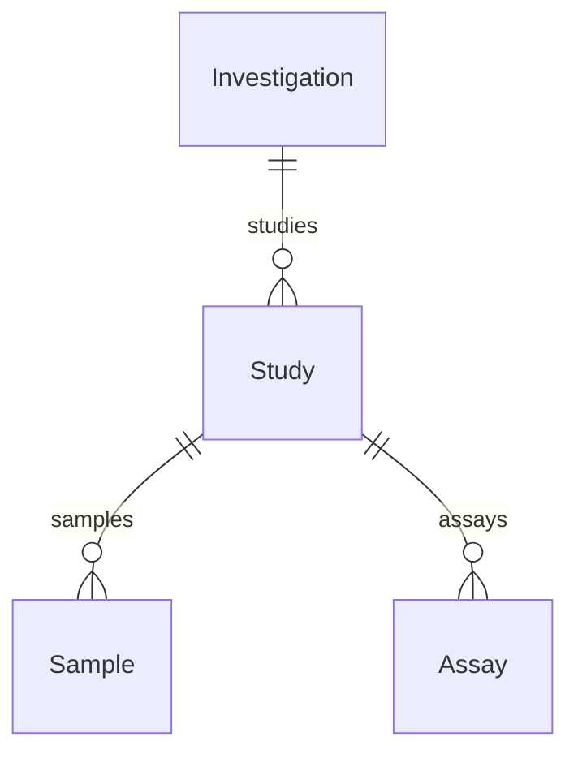

# SEEK-ready (ISA) v1.0

A minimal, ISA-shaped starting point for a profile whose datasets upload cleanly
to [FAIRDOM-SEEK](https://seek4science.org/). Every entity maps to a SEEK/ISA
role, so a dataset built on it syncs to SEEK with nothing left behind.

Clone it in the Spec Builder, add your own fields, and keep the shape. For the
rules behind it, see
[Authoring a SEEK-ready profile](../guides/seek-ready-profiles.md).

## Structure



- **Investigation** — the overarching project (the root).
- **Study** — a study within it. One-per-study context (site, country) lives
  here as fields rather than as separate tables, so it becomes the study's
  Extended Metadata in SEEK.
- **Sample** — a material or biological sample, collected in a study.
- **Assay** — a measurement performed on samples.

There is no ObservationUnit level: without it, Samples and Assays hang directly
off the Study, the simplest correct SEEK mapping. Add one only if your data
genuinely needs it.

## Using it

```python
from metaseed.specs.loader import SpecLoader

spec = SpecLoader().load_profile(version="1.0", profile="seek-ready")
print(spec.root_entity)                 # Investigation
print(sorted(spec.entities))            # Assay, Investigation, Sample, Study

# Each entity declares the SEEK role it uploads as.
for name, entity in spec.entities.items():
    print(name, "->", entity.seek.role if entity.seek else None)
```
