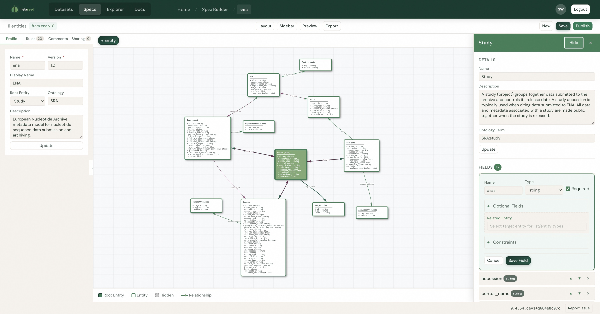
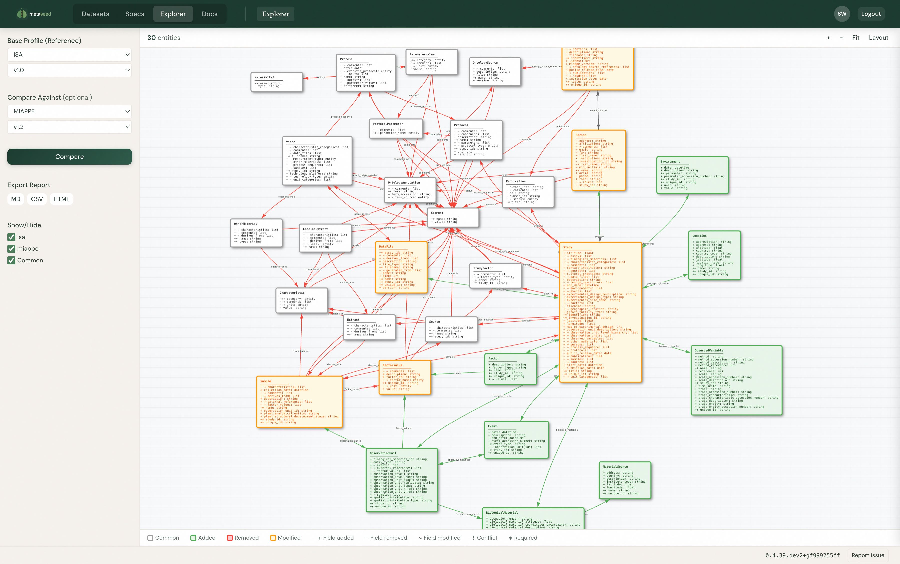
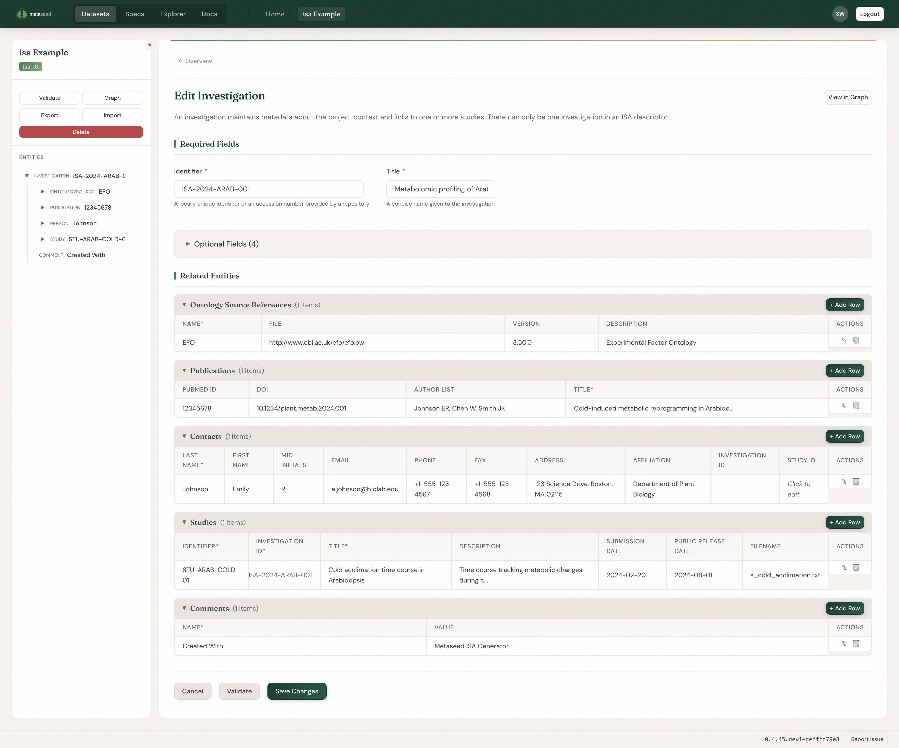
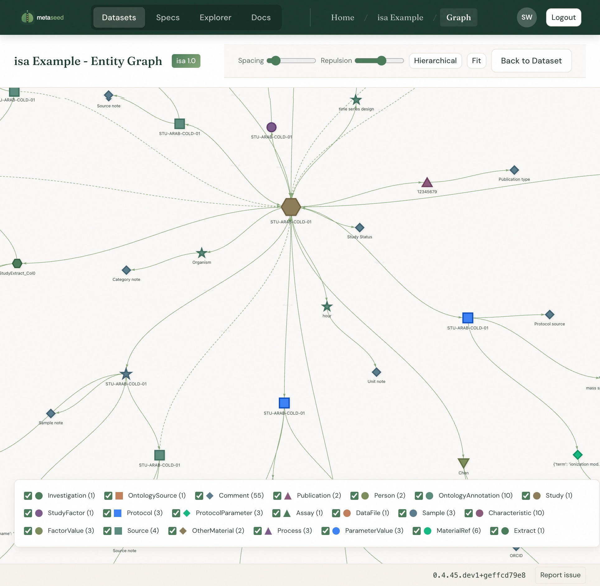

# What is Metaseed? {visibility="hidden"}

## What is Metaseed?

A **schema-driven metadata management system** that:

- Defines entity schemas in human-readable YAML
- Generates Pydantic models dynamically at runtime
- Validates with composable rules
- Supports multiple metadata standards (MIAPPE, ISA, Darwin Core, ...)

## Core Principle

```yaml
# Schema definition (YAML)
Investigation:
  fields:
    - name: unique_id
      type: string
      required: true
    - name: title
      type: string
      required: true
    - name: studies
      type: list
      items: Study
```

YAML specs → Pydantic models → Validation → Serialization

## Entity Hierarchies (MIAPPE)

```{mermaid}
graph TD
    INV[Investigation]
    STU[Study]
    BM[BiologicalMaterial]
    OU[ObservationUnit]
    SAM[Sample]
    OV[ObservedVariable]
    FAC[Factor]
    EVT[Event]

    INV --> STU
    STU --> BM
    STU --> OU
    STU --> OV
    STU --> FAC
    STU --> EVT
    OU --> SAM
    BM --> |material_source| MS[MaterialSource]
```

Tree structure with parent-child relationships.

# Architecture {visibility="hidden"}

## Architecture {.scrollable}

```{mermaid}
graph LR
    subgraph interfaces["Interfaces"]
        direction RL
        CLI["CLI<br/><small>Script automation</small>"]
        UI["Web UI<br/><small>Visual editing</small>"]
        API["REST API<br/><small>HTTP integration</small>"]
        MCP["MCP Server<br/><small>AI assistants</small>"]
    end

    subgraph core["Core"]
        Client["MetaseedClient<br/><small>Public API</small>"]
        Facade["ProfileFacade<br/><small>Entity management</small>"]
        Factory["Model Factory<br/><small>YAML → Pydantic</small>"]
        Validators["Validation Engine<br/><small>Composable rules</small>"]
    end

    subgraph data["Data Layer"]
        Specs["YAML Specs<br/><small>Schema definitions</small>"]
        Repo["Entity Storage<br/><small>Save/load entities</small>"]
        Storage["JSON/YAML Files<br/><small>On disk</small>"]
    end

    interfaces --> Client
    Client --> Facade
    Facade --> Factory
    Facade --> Validators
    Factory --> Specs
    Validators --> Repo
    Repo --> Storage
```

## Specification System {.smaller}

Three-level hierarchy:

| Level | Class | Purpose |
|-------|-------|---------|
| Profile | `ProfileSpec` | Collection of entities + validation rules |
| Entity | `EntitySpec` | Single entity with fields + constraints |
| Field | `FieldSpec` | Field type, validation, ontology reference |

**10 field types:** string, integer, float, boolean, date, datetime, uri, ontology_term, list, entity

## Supported Profiles {.smaller}

::: {style="font-size: 0.65em;"}

| Profile | Version | Entities | Fields | Domain |
|---------|---------|----------|--------|--------|
| MIAPPE | 1.2 | 14 | 163 | Plant phenotyping |
| ISA | 1.0 | 22 | 139 | Life science |
| Darwin Core | 1.0 | 10 | 189 | Biodiversity |
| DiSSCo | 0.4 | 16 | 261 | Digital specimens |
| ENA | 1.0 | 11 | 109 | Nucleotide archive |
| JERM | 1.0 | 24 | 229 | Systems biology |

:::

User-defined profiles supported in `~/.local/share/metaseed/specs/`

## Technology Stack {.smaller}

**Core:**

- Python 3.11+, Pydantic 2.0+
- FastAPI, Typer, HTMX, Jinja2

**Data:**

- PyYAML, openpyxl

**Agent/MCP:**

- mcp >=1.0.0, FastMCP

**Development:**

- uv, pytest, ruff, pre-commit

## Design Patterns {.smaller}

| Pattern | Usage |
|---------|-------|
| Factory | Dynamic Pydantic model generation |
| Repository | Swappable storage backends |
| Facade | Simplified interactive API |
| Strategy | Pluggable file parsers |
| Composite | Entity hierarchies |
| Adapter | State wrappers for repository interface |

# Modi Operandi {visibility="hidden"}

## Modi Operandi

Metaseed operates in **four modes**:

1. **CLI Mode** — Script automation
2. **Web UI Mode** — Visual editing
3. **REST API Mode** — HTTP integration
4. **Programmatic API** — Python code

Each mode uses the same core library.

## Mode 1: CLI

```bash
# List entities in a profile
metaseed entities miappe 1.2

# Generate entity template
metaseed template miappe 1.2 Investigation

# Validate a dataset
metaseed validate dataset.yaml --profile miappe --version 1.2

# Start MCP server
metaseed mcp --transport stdio
```

Built with **Typer** framework.

## Mode 2: REST API

```bash
# Health check
GET /health

# List available schema versions
GET /schemas

# Get JSON schema for entity
GET /schemas/miappe/1.2/Investigation

# Validate entity data
POST /validate
Content-Type: application/json
{"profile": "miappe", "version": "1.2",
 "entity": "Investigation", "data": {...}}
```

# Spec Builder {visibility="hidden"}

## Spec Builder

{fig-align="center" width="85%"}

## Spec Builder Features

- Visual schema design for custom profiles
- Entity graph with field details
- Add/edit fields with type, constraints, ontology terms
- Define entity relationships
- Export to YAML specification

# Explorer {visibility="hidden"}

## Explorer

{fig-align="center" width="85%"}

## Explorer Features

- Compare metadata profiles side-by-side
- Visualize entity structures
- Understand differences between standards
- Browse available profiles

# Entity Editor {visibility="hidden"}

## Entity Editor

{fig-align="center" width="85%"}

## Entity Editor Features

- Dynamic form generation from schema specs
- Required vs optional field sections
- Related entities with inline editing
- Real-time validation feedback
- Entity tree navigation

# Graph View {visibility="hidden"}

## Graph View

{fig-align="center" width="85%"}

## Graph View Features

- Force-directed layout visualization
- Entity types shown with distinct shapes/colors
- Interactive controls (spacing, repulsion, hierarchical)
- Legend with entity counts
- Click to navigate to entity

# Python API {visibility="hidden"}

## Python API {.smaller}

Three sub-modes:

```python
# 1. MetaseedClient (recommended)
from metaseed import MetaseedClient
client = MetaseedClient("miappe", "1.2")
inv = client.create_entity("Investigation", {"unique_id": "INV001", "title": "..."})

# 2. ProfileFacade (interactive/notebooks)
from metaseed import miappe
m = miappe()
m.Investigation.help()  # Show fields
inv = m.Investigation(unique_id="INV001", title="...")

# 3. Legacy API (direct model access)
from metaseed import get_model
Investigation = get_model("Investigation")
```

## Entity Creation Example

```python
from metaseed import MetaseedClient

client = MetaseedClient("miappe", "1.2")

# Create root entity
inv = client.create_entity("Investigation", {
    "unique_id": "INV001",
    "title": "Drought Tolerance Study",
    "description": "Multi-year field trial..."
})

# Create child with parent linkage
study = client.create_entity("Study", {
    "unique_id": "STU001",
    "title": "Field Trial 2024",
    "start_date": "2024-03-01"
}, parent_id=inv.id)

# Validate entire dataset
result = client.validate()
print(f"Valid: {result.is_valid}, Errors: {len(result.errors)}")
```

# Validation {visibility="hidden"}

## Validation

**Composable validation rules:**

- Required field checking
- Pattern matching (regex)
- Range validation (min/max values)
- Uniqueness constraints
- Referential integrity

## Validation Rules {.smaller}

Full list of validation types:

- Required field checking
- Pattern matching (regex)
- Range validation (min/max values)
- Date range validation
- Coordinate pair validation
- Uniqueness constraints (within parent or global)
- Referential integrity (foreign keys)
- Conditional rules

## Validation Example

```yaml
# In profile.yaml
validation:
  - type: uniqueness
    entity: Study
    field: unique_id
    scope: parent  # Unique within Investigation

  - type: referential_integrity
    entity: ObservationUnit
    field: study_id
    references:
      entity: Study
      field: unique_id
```

# MCP Integration {visibility="hidden"}

## MCP Integration {.smaller}

**Model Context Protocol** enables AI-assisted metadata extraction.

Tool categories:

- **Profile Discovery** — list_profiles, get_profile_schema
- **File Extraction** — parse_source_file, extract_entities
- **Entity CRUD** — create_entity, update_entity, delete_entity
- **Validation** — validate_entity, validate_dataset
- **Ontology** — search_ontology, suggest_ontology_term

## What is MCP? {.smaller .scrollable}

**Model Context Protocol** — open standard for AI ↔ tool communication.

```{mermaid}
flowchart LR
    Claude["Claude<br/>(Model)"] <-->|JSON-RPC| MCP["MCP Server<br/>(metaseed)"]
```

**Request** (Claude → Server):
```json
{
  "method": "tools/call",
  "params": {
    "name": "create_entity",
    "arguments": {
      "entity_type": "Investigation",
      "data": {"unique_id": "INV-001", "title": "..."}
    }
  }
}
```

**Response** (Server → Claude):
```json
{
  "result": {
    "content": [{
      "type": "text",
      "text": {
        "valid": false,
        "errors": [
          {"field": "unique_id", "message": "Field is required"},
          {"field": "title", "message": "Field is required"}
        ]
      }
    }]
  }
}
```

## What is JSON-RPC?

Remote procedure call protocol encoded in JSON.

- **Stateless** — each call is independent
- **Transport-agnostic** — works over HTTP, WebSocket, stdio
- **Lightweight** — minimal overhead vs REST or GraphQL

MCP uses JSON-RPC 2.0 as its wire protocol.

## MCP Workflow {.smaller .scrollable}

```{mermaid}
sequenceDiagram
    participant User
    participant Claude
    participant MCP as MCP Server
    participant Core as Metaseed Core

    User->>Claude: "Extract metadata from samples.csv"
    Claude->>MCP: parse_source_file("samples.csv")
    MCP->>Core: Parse file
    Core-->>MCP: Columns + preview rows
    MCP-->>Claude: File structure

    Claude->>MCP: get_profile_schema("miappe", "1.2")
    MCP-->>Claude: Entity definitions

    Claude->>MCP: analyze_mapping(file, entity)
    MCP-->>Claude: Suggested column → field mappings

    Claude->>MCP: batch_create(entities)
    MCP->>Core: Validate + store
    Core-->>MCP: Created entities
    MCP-->>Claude: Success

    Claude-->>User: "Created 50 samples"
```

# Summary {visibility="hidden"}

## Capabilities

**What Metaseed can do:**

- Define schemas in YAML with nested hierarchies
- Generate Pydantic models at runtime
- Validate with composable rules
- Serialize to JSON/YAML
- Parse CSV, JSON, Excel files
- Integrate with AI via MCP

## Limitations

**What Metaseed cannot do:**

- Arbitrary graph relationships (trees only)
- Database storage (file-based only)
- Binary/blob types, union types
- Custom code execution in validation
- Query/search/filter operations
- Direct export to CSV, XML, Excel

## Getting Started

```bash
# Install
pip install metaseed

# Or with uv
uv pip install metaseed

# Quick start
python -c "from metaseed import miappe; m = miappe(); m.Investigation.help()"

# Start web UI
metaseed ui

# Start MCP server (for Claude Desktop)
metaseed mcp --transport stdio
```

## Resources

**metaseed** (core library)

- GitHub: [github.com/sorenwacker/metaseed](https://github.com/sorenwacker/metaseed)
- Docs: [sorenwacker.github.io/metaseed](https://sorenwacker.github.io/metaseed/)

**metaseed-hub** (web application)

- GitHub: [github.com/sorenwacker/metaseed-hub](https://github.com/sorenwacker/metaseed-hub)
- Live: [metaseed.ewi.tudelft.nl](https://metaseed.ewi.tudelft.nl)
